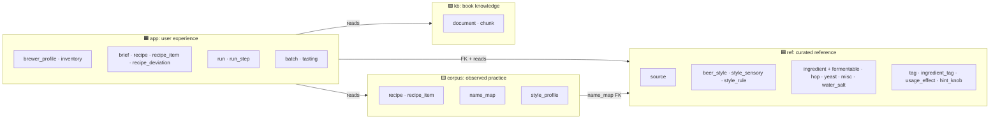
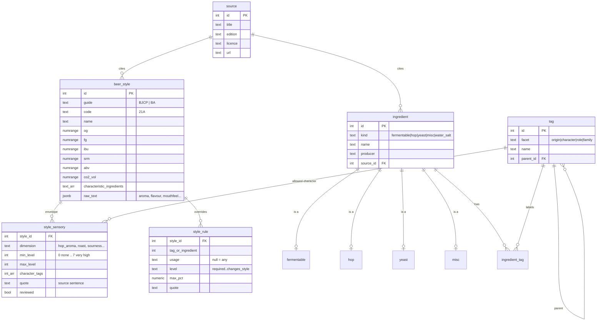
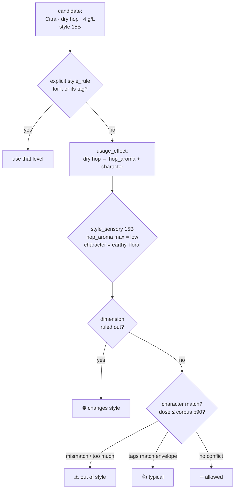
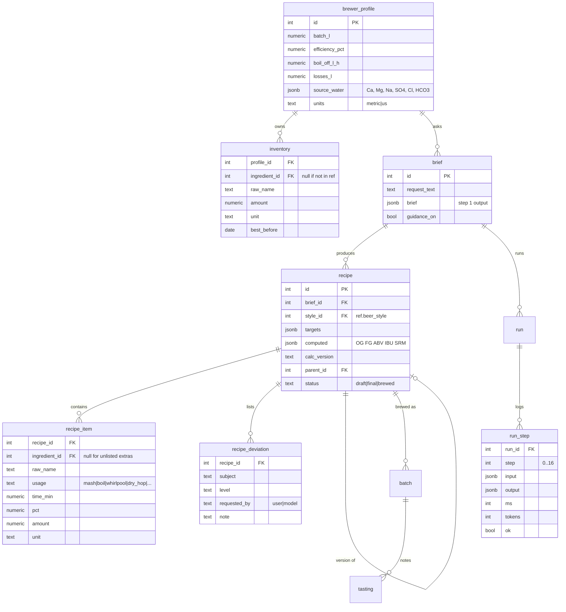

# Database design

> **Status:** design, 2026-10-08. **Nothing is built yet**: the Supabase database is empty
> since the reset. Workflow context: [RECIPE-ROADMAP.md](RECIPE-ROADMAP.md).
> Table and column names are the plan. They become real in `.sql` files applied as `postgres`
> ([OPERATIONS.md](OPERATIONS.md) §4).

---

## TL;DR

- **4 schemas, split by how much you can trust the data**, not just "fact vs user".
- `ref` = curated reference. **Every row has a source + version.** Read-only for the app.
- `corpus` = what brewers actually do (community recipes, quality-weighted). Evidence for ratios, **never cited, never embedded**.
- `kb` = book text for RAG + citations.
- `app` = everything the user experience creates: profile, inventory, briefs, recipes, logs.
- Data only points **inward**: `app` → `ref`, never `ref` → `app`.

---

## 1. The four schemas

| Schema | Holds | Trust | Written by | Cited in a recipe? |
|---|---|---|---|---|
| 🟦 `ref` | styles, sensory envelopes, ingredient specs, tags, knobs | ⭐⭐⭐ authoritative, sourced, reviewed | load scripts + your review | ✅ as data ("BJCP 2021, 21A") |
| 🟨 `corpus` | community recipes + computed per-style stats | ⭐⭐ evidence of practice | one-off load + recompute job | ❌ only as "common practice: 88 % of recipes…" |
| 🟩 `kb` | book chunks + embeddings | ⭐⭐ cited knowledge | ingestion | ✅ with page/section |
| 🟧 `app` | user data, recipes, logs | yours | the pipeline | — |

**Why "curated", not "absolute truth":** BJCP gets revised (2015 → 2021), Weyermann and
Viking report the same malt type differently, and books disagree (IBU formulas). Source +
version per row lets two editions coexist and lets every number be traced.

---

## 2. `ref`: curated reference

| Table | Key columns | Filled from | Rows (source) |
|---|---|---|---|
| `source` | title, edition, licence, url | by hand | ~15 |
| `beer_style` | guide, code, ranges (`numrange`), CO₂ volumes, raw text | `styles.json`, `ba_styles.json` | 116 BJCP + 169 BA |
| `style_sensory` | dimension, min/max level, character tags, quote, `reviewed` | BA: parsed by code · BJCP: LLM extract → **you review** | ~15 per style |
| `style_rule` | selector (tag or ingredient), usage, level, cap | by hand, rare | few |
| `ingredient` | kind, name, producer, source | all below | — |
| `fermentable` | potential (SG), colour (EBC + °L), role, max % | `malts.json` (77) + maltster sheets | 77+ |
| `hop` | alpha/beta range, oils, origin | `hops.json` 72 · `hops.hopslist.json` 268 · Brewtarget 282 (overlap, merge by name) | ~300 |
| `yeast` | producer, product id, attenuation range, temperature range, flocculation, alcohol tolerance | Brewtarget data (296 + 275) | ~500 after dedupe |
| `misc` | type (spice, fruit, fining, …), **no gravity data** | corpus `misc` names, by hand | grows |
| `water_salt` | formula, ions per gram | chemistry constants | ~8 |
| `tag` · `tag_synonym` | facet, name, parent ("citrusy" → citrus) | hops.json `flavour`, malt roles, yeast families | ~150 |
| `ingredient_tag` | ingredient ↔ tag, weight, `auto` or `reviewed` | derived by code from the ingredient's own data ([STYLE-FIT.md](STYLE-FIT.md) §2) | — |
| `usage_effect` | (kind, usage) → which sensory dimensions it drives, carries character or not | by hand, one small global table | ~20 |
| `sensory_dimension` | name, class (core · specialty · transforming), specialty category, intensity cut points | by hand + calibrated on the corpus ([STYLE-FIT.md](STYLE-FIT.md) §4) | ~15 |
| `hint_knob` | hint word → knob + direction + source | by hand, sourced | ~20 |
| `fault` *(later)* | name, descriptors, causes | `beer_faults.json` | 21 |

**Rules for `ref`**
- Every row has `source_id` (and the source has an edition).
- Units are SI (kg, L, °C, SG, EBC). Conversion happens only at display.
- Extras without gravity data (cinnamon, vanilla) are `misc` and **never enter the OG/IBU/SRM
  maths**.

### How a style rule is resolved (pure SQL, no LLM)

✅ *required* comes from the style's characteristic ingredients and is checked at recipe
level ("the recipe has no pale base malt").

---

## 3. `corpus`: observed practice

| Table | Holds | Notes |
|---|---|---|
| `recipe` | one row per recipe: source, style string, batch, OG/FG/IBU/SRM as reported, **gate flags G1–G7, quality weight** | Brewer's Friend (CC0): 35,620 in the archive dump. Gates: [STYLE-PROFILES.md](STYLE-PROFILES.md) §2 |
| `recipe_item` | raw ingredient string, amount, use, time | raw strings kept as they are |
| `name_map` | raw string → `ref.ingredient` or just a role (base / crystal / roast…) + confidence | needed before any stats. Unmapped = honest, never guessed |
| `source_weight` | source → trust weight (corpus 1, books 3, own batches 5…) | config, one row per source |
| `style_profile` | per style: grist % per role (weighted median, IQR), hop split, dosage g/L percentiles, yeast ranking, misc usage, **n and family-blend share** | **computed** by a job, re-runnable |

- ⛔ Never embedded into `kb`. Self-reported, unvalidated data must not look like a citation.
- `style_profile` is the D7 ratio source. It feeds steps 5–9 of the workflow.

---

## 4. `kb`: book knowledge

| Table | Holds |
|---|---|
| `document` | title, author, edition, licence, file path, `source_id` → `ref.source` |
| `chunk` | document, section path, page, text, tokens, `embedding vector(1024)` (bge-m3), `fts tsvector` |

- Hybrid retrieval: HNSW vector index + full-text, fused.
- Only prose is stored here. Tables and formulas found in a book go through the
  **doc → calculation pass** first and land in `ref` or in code ([roadmap](RECIPE-ROADMAP.md) §6).

---

## 5. `app`: user experience

| Table | Why it exists |
|---|---|
| `brewer_profile` | equipment + water, stored once (step 0) |
| `inventory` | "use what I have" scoring in steps 6–9 |
| `brief` | the parsed request, so a recipe can be regenerated |
| `recipe` + `recipe_item` | the recipe **as rows**, with ratio (`pct`) **and** amount, plus the calc-code version that produced the numbers |
| `recipe_deviation` | the Deviations box: what is out of style, and whether you or the model asked for it |
| `run` + `run_step` | one log row per pipeline step: input, output, time, tokens. Debugging and evals |
| `batch` + `tasting` *(later)* | what was actually brewed and measured, for feedback |

---

## 6. Access rules

| Role | `ref` | `corpus` | `kb` | `app` |
|---|---|---|---|---|
| `postgres` (owner, migrations) | all | all | all | all |
| loader scripts | write | write | write | — |
| pipeline (n8n / service) | read | read | read | **read + write** |
| Supabase MCP (Claude Code) | read | read | read | read |

- All objects are owned by `postgres` and created from `.sql` files in the repo
  ([OPERATIONS.md](OPERATIONS.md) §4), never through MCP.
- `ref` has no foreign keys pointing into `app`.

---

## 7. Build order

| # | Step | Done when |
|---|---|---|
| 1 | `ref.source`, `ref.beer_style` ← both style JSONs | 116 + 169 rows, 5 spot-checked against the PDFs |
| 2 | `ref.ingredient` + kind tables ← malts, hops, Brewtarget yeasts, salts | counts match the sources after dedupe |
| 3 | `tag`, `ingredient_tag`, `usage_effect` | every hop has ≥ 1 character tag |
| 4 | `corpus.*` ← archive dump · `name_map` · `style_profile` job | ≥ 90 % of grist mass mapped to a role for the test styles |
| 5 | `style_sensory` for the test styles (BA parsed, BJCP extracted + reviewed) | the Citra table in the roadmap reproduces from SQL |
| 6 | `app.*` | a test brief → recipe rows + run_step log |
| 7 | `kb.*` | after the doc → calculation pass per book |
