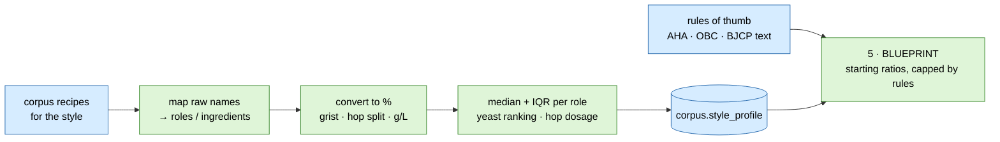
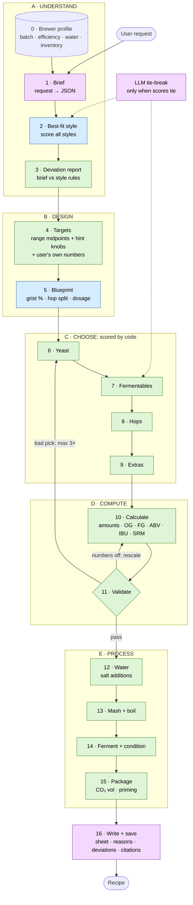
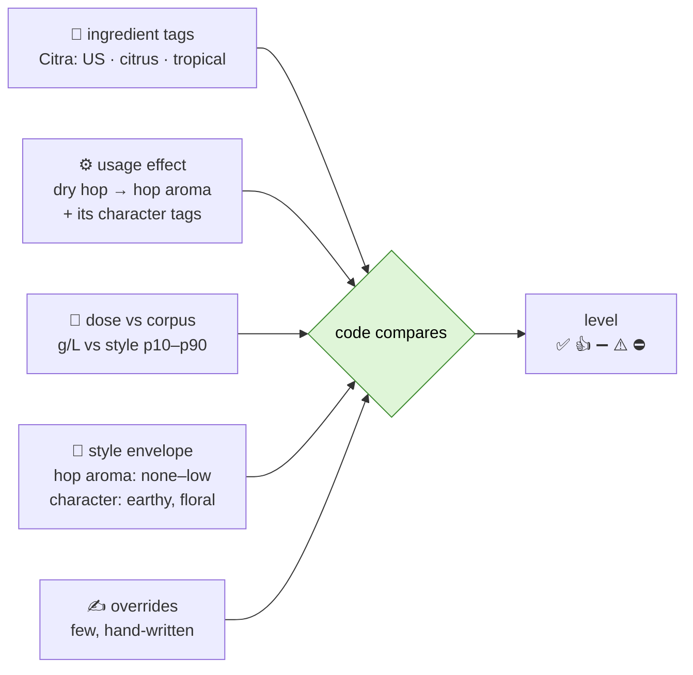
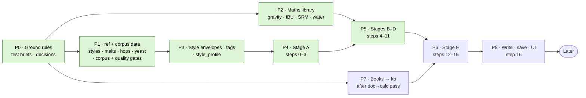

# Recipe creation: workflow + roadmap

> **Status:** agreed in review on 2026-10-08, except the items in §9.
> Database design: [DATABASE.md](DATABASE.md). Example values are illustrative unless a source is given.

---

## TL;DR

- 🧭 **The style is a compass, not a cage.** The pipeline always picks the best-fit style. The
  user can override any ingredient or number, and every override is listed, never blocked.
- 🧮 **Compute first.** The LLM reads the request and writes the recipe sheet. Everything in
  between is SQL or code: about **2 LLM calls per recipe**, plus rare tie-breaks.
- 📊 **Ratios come from open data**: Brewer's Friend recipes (CC0, 35,620 kept from 179,455),
  filtered by code and turned into per-style statistics. Thin styles borrow from their family
  ([STYLE-PROFILES.md](STYLE-PROFILES.md)).
- 🎯 **Style rules = sensory envelope + ingredient tags + usage effects**, checked by code. This
  answers "Citra in a stout?" without a row for every hop × style pair.
- 🪜 **16 steps in 6 stages.** The MVP is done after stage D.

---

## 1. Review outcomes

| # | Topic | Decision |
|---|---|---|
| 1 | Where ratios come from | Open data + free method docs (§2). Details in D7. |
| 2 | Brief before style | ✅ agreed |
| 3 | 5-level rules | ✅ agreed, organised as envelope + tags + usage (§5) |
| 4 | Style strictness | ✅ guidance only, on by default, user can override anything (§4) |
| 5 | Ingredient order | yeast → fermentables → hops → extras |
| 6 | Missing steps | ✅ added: brewer profile, water, mash + boil, fermentation, packaging, validate loop |
| 7 | Calculation first | ✅ design principle + a "doc → calculation" pass for every source (§6) |
| 8 | Curated reference, not "absolute truth" | ✅ every row has a source + version ([DATABASE.md](DATABASE.md)) |

---

## 2. Where the ratios come from

### What's out there (free)

| Tier | Source | What it gives | Licence | Use it for |
|---|---|---|---|---|
| 📊 **A: data** | [Brewer's Friend recipes, Kaggle](https://www.kaggle.com/datasets/angeredsquid/brewers-friend-beer-recipes) | 179,455 recipes (pre-2020): grist, hops with timing, yeast, misc. Archive keeps 35,620 (views > 500) | **CC0** | ⭐ **Main ratio source**, through quality gates ([STYLE-PROFILES.md](STYLE-PROFILES.md)) |
| 📊 A | [Beer Analytics](https://www.beer-analytics.com/) ([code](https://github.com/scheb/beer-analytics)) | 1.15M recipes. Per-style pages: most-used malts, hops by use, hop dosage, yeasts (e.g. American IPA: 95k recipes, avg OG 1.062, IBU 57) | site CC BY-SA 4.0 · code GPL-3 · **no data download, no API** | Hand cross-check for the test styles. Don't scrape. |
| 📊 A | [BrewDog DIY Dog as JSON](https://github.com/alxiw/punkapi) | 415 complete commercial recipes | free, **non-commercial** | Test fixtures, sanity checks |
| 📘 **B: method** | [AHA: Crash Course in Recipe Design](https://homebrewersassociation.org/how-to-brew/crash-course-beer-recipe-design/) | Method: collect ~10 recipes → convert to % → find the key ingredients → fit to the style. "85 to 100 percent base malt" | © AHA, free to read | The algorithm we automate (below) |
| 📘 B | [Oregon Brew Crew: Recipe Formulation](https://shrubbery.net/~heas/brewing/bjcp/Techniques_and_Ingredients/Recipe_Formulation.pdf) (2009) | Worked examples (Dubbel, Bohemian Pils), extract points per malt, %-based grist | free PDF, no licence stated | Rules of thumb + maths test cases |
| 📘 B | [BJCP Beer Exam Study Guide](https://legacy.bjcp.org/docs/BJCP_Study_Guide.pdf) (2017) | What a complete recipe must contain (exam question T14) | © BJCP, free | Output checklist for step 16 |
| 📘 B | [BeerSmith: Designing with percentages](https://beersmith.com/blog/2024/10/30/designing-beer-recipes-using-percentages/) | %-first grist design | ©, free to read | Background |
| 📘 B | Your *How to Brew* PDF, Section 4 / Ch. 19 | Per-style recipes for a dozen or so styles | © | kb + cross-check |
| 🧪 **C: ingredients** | [Brewtarget default data](https://github.com/Brewtarget/brewtarget/tree/develop/data) | **571 yeast entries** (attenuation + temperature ranges), 282 hops, BJCP 2021 styles, in BeerJSON | **GPL-3** | ⭐ Fills the yeast gap (D8) |
| 🧪 C | [BeerJSON](https://github.com/beerjson/beerjson) | Open recipe format standard | MIT | Import/export format |

> ⚖️ GPL-3 data is fine for a private, self-hosted project. The licence obligations only apply
> if the database is redistributed.

### The AHA method, automated (all code, no LLM)

Example output for 21A: *base 88–95 %, crystal 0–6 %, sugar 0–5 %; ~25 % of hop mass in the
boil, ~75 % in whirlpool + dry hop; top yeasts …* (the real numbers come from the corpus).

---

## 3. The flow

**Legend:** 🟪 LLM · 🟦 SQL · 🟩 deterministic code

### Step by step, with a running example

**"A really bitter American IPA with a hint of cinnamon, 20 L"**

| # | Step | Example output | How |
|---|---|---|---|
| 0 | Profile | 20 L · 72 % efficiency · tap water profile · inventory | 🟦 stored |
| 1 | Brief | `{style:"American IPA", hints:["bitter"], extras:["cinnamon"]}` | 🟪 |
| 2 | Style | **21A American IPA**: OG 1.056–1.070 · IBU 40–70 · SRM 6–14 *(styles.json)* | 🟦 score: name + numbers + sensory words |
| 3 | Deviations | cinnamon: ⚠️ not part of 21A → listed; closest category 30A (info only) | 🟩 |
| 4 | Targets | "bitter" → IBU 65 · OG 1.062 · FG 1.011 · SRM 7 | 🟩 |
| 5 | Blueprint | base ~90 % · crystal ≤ 5 % · hop split from the corpus profile | 🟦🟩 |
| 6 | Yeast | top 21A yeast in the corpus that fits FG 1.011 and is in stock | 🟩 score |
| 7 | Fermentables | fill each grist role: inventory first, then corpus popularity | 🟩 score |
| 8 | Hops | bittering = high alpha · late/dry = tags match hints (citrus, pine) | 🟩 score |
| 9 | Extras | cinnamon: stage + dose from corpus `misc` usage stats | 🟩 |
| 10 | Calculate | kg / g → OG, FG, ABV, IBU, SRM | 🟩 |
| 11 | Validate | in targets · rules · no invented items · loop max 3× | 🟩 |
| 12 | Water | SO₄:Cl high → gypsum + CaCl₂ grams from the source-water ions | 🟩 |
| 13 | Mash + boil | 65 °C (FG target) · 60 min boil · hop times | 🟩 |
| 14 | Ferment | temperature from yeast range · dry-hop day · cold crash | 🟩 |
| 15 | Package | 2.4 vol CO₂ (style) → priming sugar g | 🟩 |
| 16 | Write + save | sheet + "why" per choice + book citations + Deviations box | 🟪🟦 |

Each step has a JSON contract that code checks, with a legal "none / unknown / conflict" slot
(PROJECT.md §6.3).

---

## 4. Style = guidance, not law

| | Guidance **ON** *(default)* | Guidance **OFF** |
|---|---|---|
| The pipeline's own choices | stay inside the style | free (the style is only a reference) |
| What **you** ask for (ingredients **or** numbers) | ✅ accepted, listed under Deviations | ✅ accepted, listed |
| Recipe sheet shows | "Deviations from 21A" + closest category (info) | comparison with the style only |

- **A style is always picked**: the one that best fits the request, so there is always a
  reference to design against and compare with.
- **Best fit can disagree with the name you used.** *"4 % imperial stout"* → *"15B Irish Stout fits
  4 % better. Keep 20C?"* Your choice wins, and the 4 % is listed as a deviation.
- **No blocking questions** for deviations. Only ask when the request is genuinely ambiguous.

---

## 5. Style rules: how they are organised

The problem: you can't write a row for every hop × style pair (**~300 hops × 285 styles**).
The fix is to describe each **style** as a sensory envelope and each **ingredient** with tags,
and let code compare the two.

| Piece | Lives in | Written | Example |
|---|---|---|---|
| **Style envelope** | `ref.style_sensory` | once per style: BA fields parsed by code, BJCP prose extracted by LLM, **you review** | 15B: hop aroma *none–low*, character *earthy, floral* |
| **Ingredient tags** | `ref.ingredient_tag` | from hops.json `flavour` / origin, malt role, yeast family | Citra: *US, citrus, tropical* |
| **Usage effects** | `ref.usage_effect` | one small global table | bittering → bitterness only (character doesn't carry) · late / dry hop → aroma + character |
| **Dose check** | `corpus.style_profile` | computed | dry hop g/L above the style's p90 → "above typical" |
| **Overrides** | `ref.style_rule` | by hand, only where the above can't say it | 16A: lactose → 👍 |

### Worked example: Citra in two stouts

BJCP text: 15B Irish Stout *"Low earthy or floral hop aroma optional"* · 20B American Stout
*"Medium to very low hop aroma, often with a citrusy or resiny character"*.

| Citra used as | 15B Irish Stout | 20B American Stout |
|---|---|---|
| 60-min bittering | ➖ allowed: bitterness only, character doesn't carry | ➖ allowed |
| Whirlpool, normal dose | ⚠️ citrus ≠ earthy / floral | 👍 citrus matches "citrusy" |
| Heavy dry hop | ⚠️ character **and** intensity above "low" | ⚠️ intensity above "medium" |

### Where each level comes from

| Level | Triggered when |
|---|---|
| ✅ required | named in the style's characteristic ingredients ("Pale base malt") |
| 👍 typical | its tags match the envelope's character words, or it ranks top in the corpus for the style |
| ➖ allowed | no conflict found |
| ⚠️ out of style | character mismatch, or intensity/dose above the envelope |
| ⛔ changes style | drives a dimension the style rules out (sourness in an IPA) |

At runtime this is **pure SQL/code**. The LLM is used once, offline, to extract BJCP envelopes.

➡️ **Full algorithm**, including automatic tagging so new hops, malts and yeasts need no rules:
[STYLE-FIT.md](STYLE-FIT.md).

---

## 6. Calculation first

> **Gate for every step:** *can this be SQL or code?* If yes, it must be. The LLM is only for
> free text in (step 1) and prose out (step 16), plus tie-breaks.

**Doc → calculation pass.** Every new source is read for tables, formulas and rules of thumb
first. Those become data or code. Only the remaining prose goes to RAG.

| Knowledge | Source | Becomes |
|---|---|---|
| Extract potential per malt | malts.json, maltster sheets, OBC table | `ref.fermentable` |
| IBU (Tinseth), colour (Morey), gravity, ABV | Palmer | maths functions |
| Mash temperature ↔ body / FG | Palmer ch. 14 | hint-knob table |
| Carbonation volumes per style, priming sugar | Palmer ch. 11 | `ref.beer_style` column + function |
| Residual alkalinity, salt additions | *Water* book | water functions |
| Pitch rate | *Yeast* book | function |
| Yeast attenuation, temperature | Brewtarget data | `ref.yeast` |
| Grist %, hop split, dosage, yeast ranking per style | Brewer's Friend corpus | `corpus.style_profile` |
| Sensory envelope | BJCP / BA text | `ref.style_sensory` |
| Faults → causes | beer_faults.json | `ref.fault` (later) |

---

## 7. Hints → knobs

The LLM only maps words to knob names in the brief. Code applies them. With guidance on,
model-chosen values stay inside the style range. Your explicit numbers always win.

| Hint | Knobs |
|---|---|
| bitter | IBU → top 25 % of range · BU:GU ↑ |
| hoppy / juicy | late + dry hop share ↑ (not IBU) |
| dry / crisp | mash 64–65 °C · high-attenuation yeast · sugar ≤ 10 % |
| full / chewy | mash 68–69 °C · oats or dextrin malt · lower-attenuation yeast |
| malty | Munich / Vienna share ↑ · BU:GU ↓ |
| darker | SRM ↑ via crystal / roast |
| stronger / session | OG ↑ / OG ↓ |
| *flavour words* (citrus, coffee…) | tag match in steps 7–9 |

*Starter table. Each row gets a book source before it is trusted.*

---

## 8. Roadmap

🟩 = MVP: a numerically correct, style-checked recipe without process text.

| Phase | Do | ✅ Done when |
|---|---|---|
| **P0** | 20 test briefs (varied styles, deviations, overrides, not just stouts). Settle D7–D9. | briefs in the repo · decisions logged |
| **P1** | `ref` + `corpus` schemas ([DATABASE.md](DATABASE.md)). Load styles (116 + 169), malts, hops, Brewtarget yeasts, water salts, the corpus with quality gates ([STYLE-PROFILES.md](STYLE-PROFILES.md) §2). | row counts match sources · 10 rows spot-checked per table |
| **P2** | Maths library with unit tests | tests pass against Palmer's and OBC's worked examples |
| **P3** | Tag vocabulary · ingredient tags · usage effects · envelopes for the test styles · `style_profile` | the Citra table (§5) reproduces from SQL |
| **P4** | Steps 0–3 | ≥ 18/20 briefs: right style, right deviations |
| **P5** | Steps 4–11 | ≥ 16/20 validate · **0 invented ingredients** · LLM calls ≤ 2 + tie-breaks |
| **P7** | Doc → calc pass per book, then ingest the rest into `kb`, retrieval eval | recall@5 measured, above an agreed bar |
| **P6** | Steps 12–15 | every recipe has water, mash, ferment, package |
| **P8** | Step 16 + interface (D5) | you can brew from the sheet |
| **Later** | BA as a selectable guide · inventory-first mode · substitutions · batch log → feedback | |

---

## 9. Still open

| # | Question | Recommendation |
|---|---|---|
| D7 | Ratio source | Brewer's Friend corpus through quality gates → `style_profile` with family shrinkage for thin styles, extra weighted sources, AHA/OBC rules of thumb as caps, Beer Analytics as a manual cross-check ([STYLE-PROFILES.md](STYLE-PROFILES.md)) |
| D8 | Yeast data | Brewtarget default data (571 entries, GPL-3) |
| D9 | Who approves style envelopes | LLM extracts, you review |
