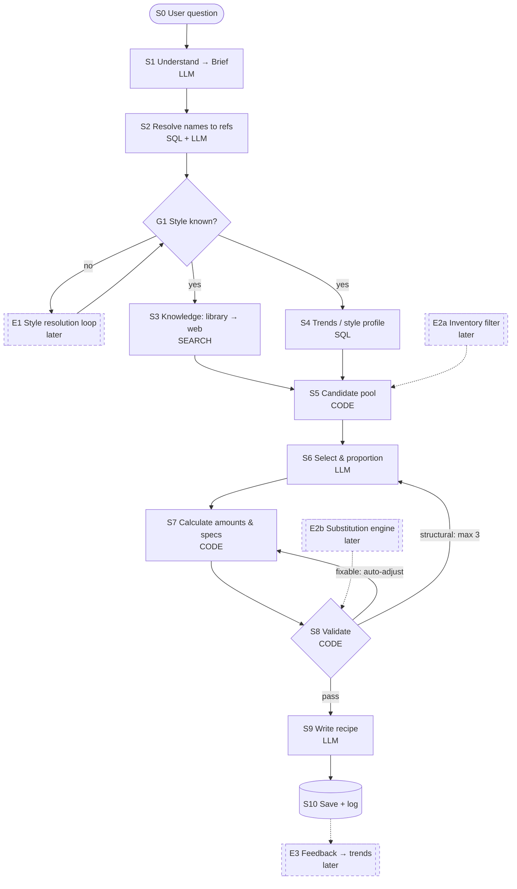

# Recipe Creation Workflow: Brainstorm

> Status: **idea / brainstorm** (2026-09-23). A clean-slate design that deliberately
> ignores what already exists. Print this and mark it up.
>
> Legend: `LLM` model call · `SQL` database query · `CODE` deterministic script ·
> `SEARCH` library/web retrieval · `GATE` decision point · `EXT` extension slot (later)

---

## 1. The one-sentence architecture

**The LLM decides *what* goes in the beer and *why*; code decides *how much*, and checks
that the result is the beer that was asked for.**

The LLM is used in three places only: understanding the question (S1), choosing
ingredients and proportions (S6), and writing the final recipe (S9). Everything else is
SQL or a script, which keeps the numbers reproducible and testable.

---

## 2. Flow diagram (print view)

```
                     ┌─────────────────────────────────────┐
                     │ S0  USER QUESTION                   │
                     └──────────────────┬──────────────────┘
                                        ▼
                     ┌─────────────────────────────────────┐
                     │ S1  UNDERSTAND -> BRIEF       [LLM] │
                     │     must / avoid / concepts /       │
                     │     sensory / style / targets       │
                     └──────────────────┬──────────────────┘
                                        ▼
                     ┌─────────────────────────────────────┐
                     │ S2  RESOLVE NAMES TO refs [SQL+LLM] │
                     │     "Citra" -> hop id               │
                     │     "American IPA" -> style id      │
                     └──────────────────┬──────────────────┘
                                        ▼
                               ┌─────────────────┐              ╔═════════════════════╗
                               │ G1 style known? ├─────no──────►║ E1 STYLE RESOLUTION ║
                               │          [GATE] │              ║    LOOP     (later) ║
                               └────────┬────────┘              ╚══════════╤══════════╝
                                        │ yes                              │
                                        ├◄─────────────────────────────────┘
                    ┌───────────────────┴───────────────────┐
                    ▼                                       ▼
   ┌─────────────────────────────────┐     ┌─────────────────────────────────┐
   │ S3  KNOWLEDGE         [SEARCH]  │     │ S4  TRENDS / PROFILE      [SQL] │
   │     library first, web for gaps │     │     targets, ingredient priors, │
   │     -> evidence pack + sources  │     │     ratios, process priors      │
   └────────────────┬────────────────┘     └────────────────┬────────────────┘
                    └───────────────────┬───────────────────┘
                                        ▼
                     ┌─────────────────────────────────────┐    ╔═════════════════════╗
                     │ S5  CANDIDATE POOL         [CODE]   │◄───║ E2a INVENTORY       ║
                     │     trend top-N + descriptor hits   │    ║     FILTER   (later) ║
                     │     + must_include - avoid          │    ╚═════════════════════╝
                     └──────────────────┬──────────────────┘
                                        ▼
                     ┌─────────────────────────────────────┐
              ┌─────►│ S6  SELECT & PROPORTION     [LLM]   │
              │      │     ids, roles, %, hop use, mash    │
              │      └──────────────────┬──────────────────┘
              │                         ▼
              │      ┌─────────────────────────────────────┐
              │  ┌──►│ S7  CALCULATE              [CODE]   │
              │  │   │     kg, g, OG, FG, ABV, IBU, SRM    │
              │  │   └──────────────────┬──────────────────┘
              │  │                      ▼
              │  │   ┌─────────────────────────────────────┐    ╔═════════════════════╗
              │  │   │ S8  VALIDATE               [CODE]   │◄───║ E2b SUBSTITUTION    ║
              │  │   │     style ranges, must / avoid,     │    ║     ENGINE   (later) ║
              │  │   │     trend outliers                  │    ╚═════════════════════╝
              │  │   └───┬─────┬────────┬──────────────────┘
              │  │       │     │        │ pass
              │  └───────┘     │        │
              │  fixable:      │        │
              │  auto-adjust   │        │
              └────────────────┘        │
              structural: back to S6    │
              (max 3 rounds)            │
                                        ▼
                     ┌─────────────────────────────────────┐
                     │ S9  WRITE RECIPE             [LLM]  │
                     │     recipe + reasoning + sources    │
                     └──────────────────┬──────────────────┘
                                        ▼
                     ┌─────────────────────────────────────┐    ╔═════════════════════╗
                     │ S10 SAVE + LOG              [SQL]   ├───►║ E3 FEEDBACK ->      ║
                     └─────────────────────────────────────┘    ║    TRENDS   (later) ║
                                                                ╚═════════════════════╝

   Double-line boxes (╔═╗) are extension slots: not built now, but the arrow is reserved.
```

## 3. Flow diagram (rendered view)

Same flow; renders in VS Code / GitHub preview.



---

## 4. Step table: what each step needs and produces

Tick the boxes as you go. `MVP` = needed for the first functional version (`lib` = library
search only; web comes later).

| #   | Step                  | Type     | Needs (input)                          | Produces (output)                      | MVP | Designed | Built | Tested |
|-----|-----------------------|----------|----------------------------------------|----------------------------------------|:---:|:--------:|:-----:|:------:|
| S0  | User question         | -        | chat message                           | raw text                               | ✔   | ☐        | ☐     | ☐      |
| S1  | Understand → Brief    | LLM      | S0                                     | **Brief** (typed JSON, see §6)         | ✔   | ☐        | ☐     | ☐      |
| S2  | Resolve names to refs | SQL+LLM  | Brief, `refs.*`                        | Brief with `ref_id`s + unresolved list | ✔   | ☐        | ☐     | ☐      |
| G1  | Style known?          | GATE     | Brief.style                            | continue / ask user (E1 later)         | ✔   | ☐        | ☐     | ☐      |
| S3  | Knowledge             | SEARCH   | Brief concepts, sensory, unresolved    | **Evidence pack** with citations       | lib | ☐        | ☐     | ☐      |
| S4  | Trends / profile      | SQL      | style id, `trends.*` → `refs.*`        | **Style profile** (targets + priors)   | ✔   | ☐        | ☐     | ☐      |
| S5  | Candidate pool        | CODE     | S3, S4, must/avoid                     | **Candidate pool** per category        | ✔   | ☐        | ☐     | ☐      |
| S6  | Select & proportion   | LLM      | Brief, pool, profile, evidence         | **Selection** (ids, roles, %, no grams)| ✔   | ☐        | ☐     | ☐      |
| S7  | Calculate             | CODE     | Selection, profile targets, `refs` specs, batch | **Calc result** (amounts + specs) | ✔ | ☐     | ☐     | ☐      |
| S8  | Validate              | CODE     | Calc result, style ranges, Brief       | pass / fixable / structural + reasons  | ✔   | ☐        | ☐     | ☐      |
| S9  | Write recipe          | LLM      | Calc result, Selection rationale, evidence | final recipe text                  | ✔   | ☐        | ☐     | ☐      |
| S10 | Save + log            | SQL      | everything above                       | stored recipe + run trace              | ✔   | ☐        | ☐     | ☐      |
| E1  | Style resolution loop | LLM+SQL  | Brief without style                    | 1–3 candidate styles → user picks      |     | ☐        | ☐     | ☐      |
| E2a | Inventory filter      | CODE     | user inventory                         | pool restricted to what you own        |     | ☐        | ☐     | ☐      |
| E2b | Substitution engine   | CODE     | missing item, `refs` specs             | closest substitute + spec delta        |     | ☐        | ☐     | ☐      |
| E3  | Feedback → trends     | SQL      | brewed + rated recipes                 | weighted trends                        |     | ☐        | ☐     | ☐      |

Notes:

```
_______________________________________________________________________________________

_______________________________________________________________________________________

_______________________________________________________________________________________
```

---

## 5. Step-by-step notes

### S1 · Understand → Brief

**Is expanding it easy? Yes**, as long as the Brief is a **typed object with every field
optional**, not free text. Adding a field later is additive: old runs still validate.
The real cost of a new field is not parsing it, it is giving it a *consumer*
downstream. A field nobody reads is noise, so add fields when a later step needs them.

Two ideas worth building in from day one:

1. **Every field carries its source**: `user` | `inferred` | `default` | `missing`. This
   is what makes the E1 style loop trivial later ("style.source = missing → ask").
2. **Split hard constraints from soft preferences.** `must_include`, `avoid`, style and
   explicit targets are *hard* (validator enforces them). Concepts and sensory words are
   *soft* (they steer selection, but nothing fails if one is missed).

Fields to consider beyond your list: target ABV / IBU / colour, batch size, efficiency
(from an equipment default), and `open_questions` (things the model could not decide).

- [ ] Brief schema written
- [ ] LLM prompt with structured output
- [ ] Source tag on every field

### S2 · Resolve names to refs *(new step, and the one I'd push for)*

Before anything can be calculated, "Citra", "Maris Otter", "no crystal" and "NEIPA" must
become `refs` rows. Without ids you have no alpha acid, PPG or colour, so the calculator
has nothing to work with. Do it as trigram/alias match first, with LLM
disambiguation only for ties.

⚠️ `avoid` is often a **category**, not an item ("no crystal malts", "no American hops").
So `refs` needs a role/category taxonomy the avoid list can point at.

Unresolved names go to S3 (web) instead of being dropped.

- [ ] Alias / fuzzy match per refs table
- [ ] Category-level avoid supported
- [ ] Unresolved list handed to S3

### S3 · Knowledge (library → web)

Search per concept and sensory descriptor, library first; web only for what the library
cannot answer. The output should be a **structured evidence pack**, where each finding is
`{claim, suggests_ref_id?, source, confidence}`, so it can *add candidates* in S5
instead of only being prompt text.

A cheaper path for sensory words: if `refs` carries descriptor tags (hop aroma tags, malt
flavour tags), "tropical, dank" → hop candidates is a **SQL query**, not a search.
Use search for concepts the tags cannot express ("like a Belgian but crisp").

S3 and S4 are independent given the Brief, so run them **in parallel**.

- [ ] Library search per concept
- [ ] Web fallback for gaps + unresolved
- [ ] Descriptor tags on refs (hops, malts, yeast)

### S4 · Trends / style profile

Returns one **style profile**: target ranges plus ingredient and process priors.
Detailed ideas in §7.

- [ ] Style targets (OG/FG/IBU/SRM/ABV ranges)
- [ ] Hop / fermentable / yeast / misc priors
- [ ] Fallback when sample size is small

### S5 · Candidate pool

Deterministic union: trend top-N per category + descriptor/evidence hits +
`must_include`, minus `avoid`. Each candidate keeps *why* it is there (`trend`, `descriptor`,
`evidence`, `user`) and its trend stats.

This is the step that stops the LLM from inventing ingredients: **S6 may only pick ids
from this pool.**

**▶ E2a slot (inventory):** filter the pool to what the user owns. Two modes worth
planning for: `strict` (only owned) and `prefer` (owned first, others allowed).

- [ ] Pool builder
- [ ] Reason + stats kept per candidate

### S6 · Select & proportion (LLM)

To your question, *"am I right?"*: **yes, with one refinement.** The LLM should output
**choices and proportions, never grams**:

- fermentables: `ref_id`, role (base / specialty / adjunct / sugar), **% of grist**
- hops: `ref_id`, use (bittering / flavour / whirlpool / dry hop), **g/L for late
  additions**; the bittering addition is left for the script to solve
- yeast: `ref_id`
- misc: `ref_id`, use, timing
- mash temperature (a *choice* that drives body and FG, not a calculation)
- chosen targets inside the style range (for example "OG 1.062, IBU 35")
- a short rationale per item, pointing at evidence / trend ids

The prompt gets the Brief, the pool with trend stats, and the style profile, and is told
to stay inside the trend p10–p90 ranges unless the Brief says otherwise.

- [ ] Selection schema
- [ ] Prompt with pool + profile
- [ ] Rejects ids not in pool

### S7 · Calculate (code)

The trick is picking **balancing variables**: most amounts come straight from trend
ratios, and one item per category is solved to hit the target.

| Quantity         | Set by                               | Balancing variable (solved)       |
|------------------|--------------------------------------|-----------------------------------|
| OG               | target from S6                       | **base malt kg**, specialties fixed by % |
| IBU              | target from S6                       | **bittering hop g** (Tinseth), after late hops |
| Late / dry hops  | trend g/L                            | -                                 |
| FG               | yeast attenuation × mash-temp adjustment × fermentability | - (it is an estimate) |
| ABV              | from OG, FG                          | -                                 |
| SRM              | Morey from grist                     | - (checked, not solved)           |

Calculation order matters: **gravity → IBU** (utilisation depends on boil gravity)
**→ FG → ABV → SRM**. Batch size, efficiency, boil-off and losses come from an equipment
default (**▶ E5 slot** later).

⚠️ FG is the weakest number: attenuation adjusted for mash temperature is a heuristic.
Label it as an estimate in the output.

- [ ] Gravity solver (base malt balances)
- [ ] Tinseth IBU solver (bittering balances)
- [ ] FG estimate, ABV, SRM (Morey)
- [ ] Unit tests against a few known recipes

### S8 · Validate (code)

Checks: OG/FG/ABV/IBU/SRM inside style range and user targets · every `must_include`
present · nothing from `avoid` (including category-level) · each % / g/L inside trend
p5–p95 (warning, not failure) · BU:GU sane.

Three outcomes:

- **pass** → S9
- **fixable** (numbers only, for example IBU 4 over) → auto-adjust the balancing variable → S7
- **structural** (for example SRM far out because of the chosen malts) → back to S6 with the
  reasons; **max 3 rounds**, then return the best attempt with warnings

**Conflict policy** when things disagree:
`hard user constraints > style ranges > soft preferences > trend priors`.
If a `must_include` is rare for the style (for example 0% in trends), don't fail. Warn and
say so in the recipe.

**▶ E2b slot (substitution):** when a selected item is unavailable, swap it for the
nearest `refs` item in the same substitution group (fermentable: type + colour + PPG; hop:
alpha + aroma tags; yeast: attenuation + temperature + flavour profile), then re-run S7.

- [ ] Range + constraint checks
- [ ] Auto-adjust loop
- [ ] Structural loop back to S6 with reasons

### S9 · Write recipe (LLM)

Writing only, with no new decisions. It gets the final numbers and the rationale and
produces the recipe, the "why" behind each choice with citations, and the warnings.

- [ ] Output template
- [ ] Citations from evidence pack

### S10 · Save + log

Persist **every intermediate object** (Brief, evidence pack, profile, pool, selection,
calc result, validation). This pays for itself three ways: debugging, evals, and the
**▶ E4 slot (refine)**: "make it more bitter" re-enters at S6/S7 with saved state instead
of starting over.

**▶ E3 slot (feedback):** brewed + rated recipes feed back into trend weighting.

- [ ] Recipe stored
- [ ] Each step output logged per run

---

## 6. Data contracts (sketch)

These objects flow between the steps. Keep them versioned. Adding optional fields is the
main way the workflow grows.

```jsonc
// Brief (S1 → S2)
{
  "style":        {"value": null, "ref_id": null, "source": "missing"},
  "must_include": [{"text": "Citra", "ref_id": null, "kind": "item"}],
  "avoid":        [{"text": "crystal malt", "ref_id": null, "kind": "category"}],
  "concepts":     ["hazy", "soft bitterness"],
  "sensory":      {"aroma": [], "flavour": [], "appearance": [], "mouthfeel": []},
  "targets":      {"abv": null, "ibu": null, "srm": null},
  "batch":        {"volume_l": 20, "efficiency": 0.72, "source": "default"},
  "open_questions": []
}

// Selection (S6 → S7): proportions only, no grams
{
  "fermentables": [{"ref_id": 12, "role": "base", "pct": 80}, ...],
  "hops":  [{"ref_id": 7, "use": "dry_hop", "g_per_l": 8}, {"ref_id": 3, "use": "bittering"}],
  "yeast": {"ref_id": 44},
  "misc":  [],
  "mash_temp_c": 67,
  "targets": {"og": 1.062, "ibu": 35},
  "rationale": [{"ref_id": 7, "why": "...", "evidence": ["ev3", "trend:hop:7"]}]
}
```

---

## 7. Trend ideas (S4)

Your list (popularity, ratio, amount, co-occurrence, specs for substitution) is the right
core. Additions, roughly in priority order:

| Trend                         | What it stores (per style)                                  | Why it helps                                   | When  |
|-------------------------------|-------------------------------------------------------------|------------------------------------------------|:-----:|
| **Percentiles, not averages** | p10 / p50 / p90 of every % and g/L                          | gives S6 a range and S8 an outlier test        | now   |
| **Sample size `n`**           | recipe count behind each stat                               | don't trust n < ~10; fall back to parent style | now   |
| **Usage by role**             | hops split by bittering / whirlpool / dry hop; malts by role | same hop, different job, different amounts     | now   |
| **Real vital stats**          | actual OG/FG/IBU/SRM distribution of recipes                | "what brewers do" vs the guideline range       | now   |
| **Co-occurrence with lift**   | pairs that appear together *more than chance*               | "what goes with Citra?" beyond raw popularity  | soon  |
| **Process priors**            | mash temp, boil time, ferment temp, dry-hop day             | S6 picks mash temp from data, not a guess      | soon  |
| **Recipe shape**              | number of hops / malts per recipe, base-malt share           | stops 9-malt kitchen-sink recipes              | soon  |
| **Substitution groups**       | fermentable: type + colour band + PPG; hop: alpha + tags    | powers E2b                                     | E2    |
| **Water profile**             | sulfate:chloride ratio distribution                         | powers a water-chemistry slot                  | later |
| **Time trend**                | popularity per year → rising / falling                      | separates *norm* from *trend*                  | later |
| **Source weighting**          | weight by source quality / medal / rating                   | good recipes count more (links to E3)          | later |

Structural rule: **every trend row references a `refs` id** (style, hop, fermentable,
yeast, misc). Trends are *derived* data (rebuildable from the recipe corpus, for example
materialised views), and `refs` stays the single source of truth for specs.

---

## 8. Extension slots: where they plug in

| Slot | What                              | Plugs in at            | Needs first                                  |
|------|-----------------------------------|------------------------|----------------------------------------------|
| E1   | Style resolution loop             | G1 (after S2)          | `source` tag on Brief.style; style descriptions searchable |
| E2a  | Inventory: "use only what I have" | S5 (pool filter)       | user inventory table keyed to `refs`         |
| E2b  | Substitution engine               | S8 (and S6 re-select)  | substitution groups + spec-distance function |
| E3   | Feedback → trends                 | S10 → S4               | brewed/rated flag on saved recipes           |
| E4   | Conversational refine             | re-enter at S6 / S7    | every step output persisted (S10)            |
| E5   | Equipment profile                 | S7                     | efficiency / losses / boil-off per user      |
| E6   | Water chemistry                   | S7 / S8                | water trends + salt calculator               |

For E1, the style guess can come from two signals: sensory/concept text matched against
style descriptions, and an **ingredient fingerprint** (must_include matched against
trends, so Citra + oats + low IBU → NEIPA). Offer the top 3 and let the user pick, then
resume at G1.

---

## 9. Suggested build order (MVP)

1. Brief schema + S1 prompt (require style for now; G1 just asks)
2. S2 resolve to refs
3. S4 trends: percentiles + `n` + role, for hops / fermentables / yeast
4. S7 calculator + unit tests, **before** any LLM selection (test with hand-written selections)
5. S5 pool + S6 selection
6. S8 validator (auto-adjust only at first; structural loop second)
7. S9 writer + S10 logging
8. S3 library search → web fallback

Notes:

```
_______________________________________________________________________________________

_______________________________________________________________________________________

_______________________________________________________________________________________

_______________________________________________________________________________________
```
