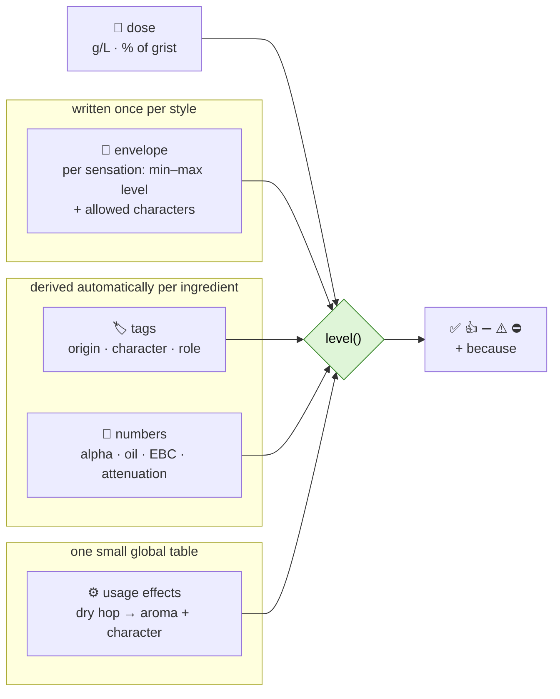

# Style fit: an algorithm for the 5 levels

> **Status:** design, 2026-10-08. Answers *"is ingredient X, used like this, in style Y:
> required, typical, allowed, out of style, or style-changing?"* deterministically, for any
> ingredient, including ones added later.
> Part of [RECIPE-ROADMAP.md](RECIPE-ROADMAP.md) steps 3, 7–9 and 11. Tables: [DATABASE.md](DATABASE.md) §2.

---

## TL;DR

- 🧩 **Nothing is written per ingredient × style.** A style is described once (sensory
  envelope) and an ingredient once (tags + numbers). A function compares them.
- ➕ **A new hop gets tagged automatically from its own data** and immediately has a level in
  all 285 styles. Zero rule rows to write.
- 🔍 **Every verdict carries a "because"**: which sensation, which quote, which number. The
  recipe sheet reuses it.
- 🧪 **A golden test set** (~50 cases you approve, Citra × stouts included) runs on every change.

---

## 1. The idea in one picture



---

## 2. Ingredient → tags (automatic, so it scales)

| Kind | Uses | Rule (code) | Example |
|---|---|---|---|
| Hop | origin, flavour text, notes, alpha, oils | origin → origin tag · descriptor dictionary (*grapefruit → citrus*, *mango → tropical*, *pine → resin*) · alpha → purpose | Citra → `US` `citrus` `tropical` |
| Fermentable | EBC, type, name keywords | role from **colour + type**, not name: base · kilned · crystal · roast · adjunct · sugar | Carafa III → `roast` |
| Yeast | type, notes, attenuation, temperature | family from type (`lager`, `american-ale`, `belgian`, `wheat`, `kveik`, `brett`, `lacto`) · character from notes (*banana, clove, clean, fruity*) | WLP001 → `american-ale` `clean` |
| Misc | type, name | category → sensation (*spice*, *fruit*, *wood*, *lactose → sweetness*) | cinnamon → `spice` |

- **The descriptor dictionary is the only hand-made part** (~150 words → tags, in
  `ref.tag_synonym`). A new hop that uses known words needs no work.
- **Unknown words never get guessed** (PROJECT.md §6.3). The ingredient is flagged
  `needs_review`. Optionally the LLM proposes tags once, and you approve them.
- **The tag tree gives partial matches:** grapefruit ⊂ citrus ⊂ fruity. Exact = 1.0, parent =
  0.5, unrelated = 0.

---

## 3. Usage effects (one global table, ~20 rows)

| Kind / role | Usage | Drives sensation | Carries character? |
|---|---|---|---|
| hop | boil ≥ 30 min | bitterness | ❌ |
| hop | boil 5–29 min | bitterness, hop flavour | ✅ |
| hop | whirlpool / flameout | hop flavour, hop aroma | ✅ |
| hop | dry hop | hop aroma | ✅ |
| roast malt | mash | roast, colour | ✅ (coffee, chocolate, acrid) |
| crystal malt | mash | caramel, sweetness, colour, body | ✅ |
| yeast | ferment | esters, phenols, dryness | ✅ |
| lacto / kettle sour | ferment / boil | sourness | — |
| spice · fruit · wood · smoke | any | spice · fruit · wood · smoke | ✅ |

---

## 4. Dose → intensity (0 none … 7 very high)

| Sensation | How it's computed |
|---|---|
| colour | exact: SRM (Morey) vs the style range |
| bitterness | exact: IBU (Tinseth) vs the range, plus BU:GU |
| hop aroma / flavour | **oil dose** = late + dry hop g/L × total oil (mL/100 g) → level |
| roast | roast index = Σ % of grist × EBC → level |
| esters / phenols | yeast character tag + fermentation temperature |
| sourness, smoke, spice… | present / absent |

**Level cut points are calibrated on the corpus, not invented.** For example: the median oil
dose of styles whose envelope says *hop aroma high* vs *low* sets the thresholds. That uses
statistics over thousands of recipes, so the noise in single recipes doesn't matter
([STYLE-PROFILES.md](STYLE-PROFILES.md)).

---

## 5. The decision

```
level(style, ingredient, usage, dose):
    1. explicit override in style_rule (most specific: ingredient > tag > kind)?  → return it
    2. for each sensation the usage drives:
         env = envelope[style][sensation]
         if style is silent on it:
             "transforming" sensation (sourness, brett funk)          → ⛔
             "specialty" sensation (spice, fruit, wood, smoke)        → ⚠️  + "specialty on <base>"
             core sensation (bitterness, aroma, malt…)                → no conflict
         intensity(dose) > env.max                                    → ⚠️  "too much"
         if it carries character and env lists characters:
             match ≥ 0.8 → 👍   ·   0.3–0.8 → ➖   ·   < 0.3 → ⚠️  "wrong character"
    3. combine: any ⛔ → ⛔ · else any ⚠️ → ⚠️ · else any 👍 → 👍 · else ➖
    4. ➖ but used in ≥ 15 % of the style's corpus recipes → 👍
```

**✅ required** is checked on the whole recipe, not per ingredient: the style's characteristic
ingredients become role requirements (15B: *roast present*; 21A: *pale base ≥ 70 % of grist*).

**Sensation classes** live in a tiny table (`ref.sensory_dimension`: name, class, specialty
category), so "silence means ⛔ / ⚠️ / fine" is data, not code.

### Worked example

| Candidate | Trace | Level |
|---|---|---|
| Citra, 60 min, 15B | bitterness only, no character · IBU in range | ➖ |
| Citra, whirlpool, 15B | aroma: citrus vs *earthy, floral* → match 0 | ⚠️ wrong character |
| Citra, whirlpool, 20B | aroma: citrus vs *citrusy, resiny* → match 1.0 | 👍 |
| Citra, dry hop 8 g/L, 20B | character ✓, oil dose above *medium* | ⚠️ too much |
| Cinnamon, 21A | spice: 21A silent, specialty sensation | ⚠️ specialty → 30A on 21A |
| Kettle sour, 21A | sourness: 21A silent, transforming sensation | ⛔ |
| A brand-new hop "X" (lime, pine) | tags auto: citrus, resin → same path as Citra | computed, no new rows |

---

## 6. Why it scales

| You add… | Work needed | Effect |
|---|---|---|
| a hop / malt / yeast | none (auto-tags), unless a word is unknown → one review | levels in all 285 styles at once |
| a style | one envelope (BA: parsed · BJCP: LLM extract + your review) | levels for every ingredient |
| a new descriptor word | one row in `tag_synonym` | every ingredient using it gets re-tagged |
| an exception | one `style_rule` row | only where the envelope can't express it |

- **Speed:** a handful of lookups per candidate. All styles × ~1,000 ingredients × 4 usages ≈
  1.1M combinations, which can be precomputed in a materialized view and refreshed when
  ingredients change. In practice it's computed on demand.
- **Guard:** `tests/style_fit_golden` holds ~50 (style, ingredient, usage, dose → level)
  cases that you approve. Any change to tags, cut points or envelopes must keep them green.
