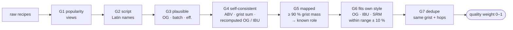

# Style profiles: good ratios from imperfect data

> **Status:** design, 2026-10-08. Every number in §1 was measured on the archived corpus
> (`~/homebrew-archive-2026-10-08/supabase-postgres.dump`, table `corpus.bf_recipes`).
> Part of [RECIPE-ROADMAP.md](RECIPE-ROADMAP.md) step 5. Decision D7.

---

## TL;DR

- 🚫 **No hand curation.** Code flags bad recipes (quality gates), and **robust statistics**
  (weighted median, IQR, trimmed tails) ignore the junk that still slips through.
- 📏 **Measured:** the archive keeps 35,620 recipes (views > 500, out of 179,455). **84 of 116
  BJCP styles have ≥ 50 recipes**, 4 have none, and all 4 are specialty catch-alls.
- 🪜 **Thin styles borrow from their family** (shrinkage). Specialty styles use their base style.
- ➕ **More is better:** add more sources, each with a trust weight. Your own brewed batches
  weigh the most.

---

## 1. What we have (measured)

Recipes per BJCP 2021 style (34,052 of 35,620 are mapped to a style):

```
 200+     ██████████████████████████████████████████████  46 styles
 50–199   ██████████████████████████████████████          38
 20–49    ███████████████████                             19
 1–19     █████████                                        9
 0        ████                                             4   28D · 29D · 30D · 34A
```

Most: 21A American IPA 5,415 · 18B American Pale Ale 3,226 · 22A Double IPA 1,373.
Fewest (non-zero): 27C Lichtenhainer 6 · 27G Pre-Prohibition Porter 11 · 31B Alt. Sugar 13.

Junk still in the 35,620:

| Check | Failed | Share |
|---|---|---|
| Name in a non-Latin script | 0 | removed at load |
| OG outside 1.020–1.150 | 219 | 0.6 % |
| ABV ≠ (OG − FG) × 131.25, off by > 1 % | 90 | 0.3 % |
| Grist % doesn't add up to 100 ± 2 | 3,287 | 9 % |

So the obvious junk is a small minority, and medians barely move because of it. The bigger
risk is **bad but plausible** recipes. Gates G4–G6 and the spot check (§2) target those.

---

## 2. Quality gates (all code)



- **A gate sets a flag and never deletes.** Each recipe keeps its flags. Its weight is the product
  of the gate scores, so thresholds can be retuned and re-run without reloading.
- **G4 is the strong one.** Recomputing OG/IBU from the ingredients with our own maths library
  catches test entries and typos that look plausible.
- **Statistics per role** (base, crystal, roast…): weighted median + IQR, ignoring below p5 and
  above p95. One bad recipe out of 300 changes nothing.
- **Spot check, once per gate change:** 30 random kept + 30 random dropped recipes. You mark each
  ✓ or ✗ (~15 min), and the filter's precision gets logged in PROJECT.md.

---

## 3. Thin styles: borrow from the family

| Good recipes for the style (n) | Profile used |
|---|---|
| ≥ 50 | the style's own |
| 1–49 | **blend** = (n · style + k · family) / (n + k), with k = 30 |
| 0 | family profile, plus the style's own OG/SRM solved by the maths library, plus its characteristic ingredients |
| specialty (BJCP 28–34) | **base style** profile + the special ingredient on top |

- **Family** = same BJCP category, otherwise a shared tag (`ipa-family`, `stout`…).
- Example: 15C Irish Extra Stout, n = 23 → 23 / 53 = **43 % its own data, 57 % the stout family**.
  The fewer recipes, the more it leans on the family.
- This is standard empirical-Bayes shrinkage. It's one formula, so it's cheap and testable.
- `style_profile` stores `n` and the blend share, so the recipe sheet can say *"based on 23
  recipes + the stout family"*.

---

## 4. More data, weighted

| Source | Size | Weight | Why |
|---|---|---|---|
| Brewer's Friend, views > 500 *(archive)* | 35,620 | 1 × quality | the bulk |
| Brewer's Friend, views 100–500, **thin styles only** | not measured yet: the archive only kept > 500, the full set needs the Kaggle download | 0.5 × quality | more n where it's missing |
| BrewDog DIY Dog | 415 | 1 | commercial, complete |
| Book recipes (Palmer ch. 19, Stout Style Guide, …) | tens | 3 | designed by experts |
| **Your brewed + rated batches** (`app.batch`) | grows | 5 | your system, your taste |
| Beer Analytics | — | — | manual cross-check only, no data download |

Every source goes through the same gates (§2). Weights are one config table, so they're easy to tune.

---

## 5. Done when

- Each test style's profile matches its Beer Analytics page by hand: base %, top 3 hops, top yeast.
- It agrees with the BJCP characteristic ingredients, e.g. 15B: roast present in ≥ 90 % of
  weighted recipes.
- The spot-check precision is logged.
