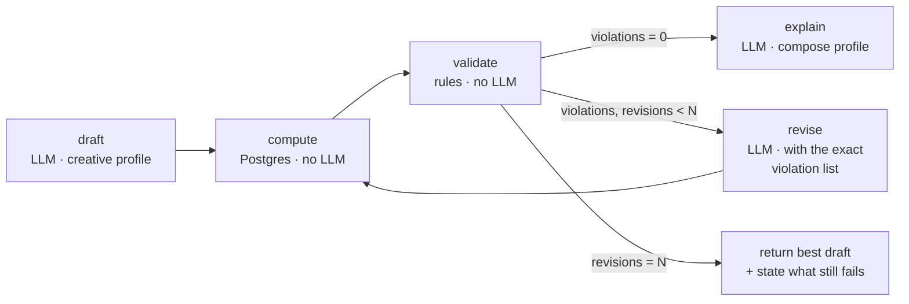
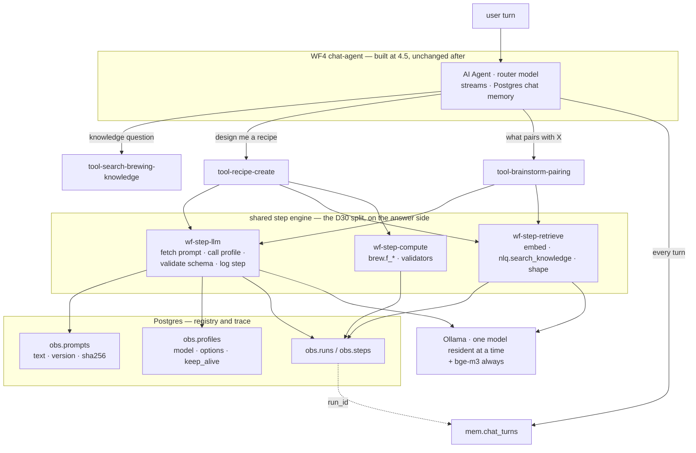

# The conversational layer — orchestrator, capabilities and steps

**Written:** 2026-08-19 · ⭐ **Revised 2026-08-19 after review** · **Status:** ⬜ proposed, nothing
built · **Scope:** everything on the answer side of the corpus. Ingestion is untouched.

**What this is:** the architecture for the layer that receives a user message and produces an
answer — routing, multi-step internal work, creative generation, web access, and the mechanism
by which a sixth capability is added without redesigning the fifth.

**What this is not:** a replacement for [`../phase3/README.md`](../phase3/README.md) §4.2.
**Book 4.5 stands exactly as scheduled and is the first phase of this plan**, unchanged.

---

## §0 — The verdict, in one screen

1. **The orchestrator is not an LLM.** It routes once per turn — which capability handles this —
   then executes that capability's **declared** steps.
2. **A capability is a deterministic pipeline with LLM calls at named steps**, not a conversation
   between agents. Fetching is code. Judgement is an LLM step. The sequence is in git.
3. **"Internal thinking" is a bounded plan→act→verify loop with a machine-checkable exit
   condition** and a step budget — not open-ended delegation.
4. ⭐ **Model-per-step is available and recommended** — sequentially, not co-resident. See §3.3.
5. **Capabilities are n8n sub-workflows exposed to the WF4 agent as tools**, one at a time,
   built on a shared step engine. Same engine/launcher split as the ingest side (D30).
6. **The LLM never produces a number that must be correct**, and never re-types a number it was
   given. §3.4.

### 0.1 ⭐ What the review changed — argued, not deleted

| First version said | Verdict | What replaces it |
|---|---|---|
| Latency is the first cost of multi-hop orchestration | ⛔ **Withdrawn.** You are explicitly trading time for quality; minutes are acceptable | Latency is no longer an argument against anything here. It survives only as a **UX** issue (§9 A1) — a three-minute run must *say* what it is doing |
| "Different models per task" is not available on 16 GB | ⛔ **Wrong as stated, and the correction matters.** It conflated **co-residency** with **sequential use** | §3.3: one 12B + `bge-m3` co-resident; **any number of models sequentially**, at ~5–15 s per switch. Your previous iteration did this because it works |
| The step runtime should be a small service (D34) | ⛔ **Overruled by decision.** n8n-only | §3.6 gives the n8n-native replacements for the two things the service was for: prompt hashing and replay. Both are recoverable; one is *better* in the n8n form |
| Conversation should populate `brew.*` (D36) | ⛔ **Withdrawn — the premise was wrong.** You are not tracking your own brews yet | §10 D36: `brew.*` goes **dormant**. Ingredient reference data moves to `ref.ingredients`, where D32's precedent already put published reference data |
| `recipe.create` has an inventory-constrained mode | **Deferred, not built.** There is no inventory and will not be for a while | §4 is unconstrained-only. The constrained mode is a later variant, not a v1 branch |
| Capability #2 is `web.lookup` | **Reordered.** You named ingredient brainstorming as a near-term goal; web is further out | §5 adds `brainstorm.pairing` as capability #2; web moves to #3 |

⭐ **What survived the review unchanged, and why it is the load-bearing part:** the argument
against free-form delegation never rested on latency. It rests on **attribution** and
**measurability** — a nested wrong choice cannot be localised, and a run with no fixed step list
has no column to predict numbers into. Both are unaffected by how long you are willing to wait.
§2.1.

---

## §1 — What is true today, measured

Checked against the live stack on 2026-08-19. ⛔ **Re-run before trusting** — this repo's history
says plan files go stale.

| Check | Result |
|---|---|
| Corpus | **2,090** chunks across **6** documents, 0 embedding gaps, 1024 dims |
| Styles | `ref.styles` **116** |
| ⛔ Truth schema | ⛔ **0 rows in all 7 `brew.*` tables** |
| ⛔ Memory | `mem.chat_turns` **0**, `mem.memories` **0** |
| ⛔ Conversational surface | ⛔ **8 workflows, all ingest launchers. No agent, no tool.** WF4 does not exist |
| `nlq` surface | **2 functions** — `search_knowledge`, `find_batches`. ⛔ **No views** |
| ⛔ Brewing math | ⛔ **`f_abv` and `f_dry_hop_rate_g_per_l` only.** No IBU, no SRM, no OG-from-grain-bill |
| Models pulled | `gemma4:12b` **7.6 GB** Q4_K_M · `bge-m3` **1.2 GB** F16. Nothing else |
| Loaded | **empty** — the first turn pays a cold load |
| Host RAM | 30 GB total, **21 available** with the stack up and no model resident |
| ⭐ Disk for models | **528 GB free**; the model store is **8.2 GB** today. ⭐ **Model count is not disk-constrained** |
| n8n | **2.23.4** |
| Eval harness | `scripts/stress/` — `tier1_routing.py`, `tier2_e2e.py`, `cases.jsonl` (**28 cases**) |

⚠️ **Unrelated, reported not fixed:** `supabase-pooler` is in a restart loop. Nothing here uses it.

**What §1 means:** the creative work you want — *"brainstorm a recipe, what works with what"* —
needs **ingredient reference data and three math functions that do not exist**. That is not a
model problem or an orchestration problem. §8 sequences it first.

---

## §2 — Why not a free-form orchestrator

### 2.1 The two costs that survive the review

**Attribution.** A 12B's tool selection degrades past ~7 choices (R3). Nesting does not add those
error rates, it multiplies them — and destroys localisation. When a recipe comes back wrong you
need to know whether the router mis-classified, retrieval missed, the draft was poor, or the
critic accepted junk. Emergent delegation gives you one bad answer and no layer to blame. ⭐ **On
a stack where a run may take three minutes, a debugging cycle you cannot localise is the
expensive thing — not the three minutes.**

**Measurability.** Every book so far was predicted and then scored; book 3 landed 30 of 30 exact.
A declared pipeline can be scored the same way, per step, with a predicted number beside each. A
loop that runs however many hops it feels like has no such column, and this project's whole
method is that column.

⛔ **Withdrawn:** latency, and the VRAM argument in the form it was first written. §0.1.

### 2.2 What replaces it

> **A capability is a declared sequence of steps. Steps that fetch are code. Steps that judge are
> LLM calls with a named profile, a prompt in the registry, and an output schema. The sequence is
> fixed; only the content flowing through it is not.**

You get the deterministic-fetch-feeds-creative-step flow you described, with data passing back
and forth, while the step count stays knowable, failure stays attributable, and the run stays
replayable.

### 2.3 What "internal thinking" is, concretely

A **bounded plan → act → verify loop with a machine-checkable exit condition**:



Three properties free-form delegation lacks: it exits on a **fact**, not on a model's opinion
that it is finished; the revision prompt carries **the specific violated rule**, worth more than
any amount of *"consider whether this is good"*; and it terminates because the budget is a number.

⭐ **With time off the table, `N` gets bigger, not smaller.** Three or four revision passes is now
a reasonable default where the first version said two — quality per run is the thing being bought.

### 2.4 Where a real agent loop *is* right

**Question-answering.** *"Why did my saison stall?"* genuinely needs the model to choose whether
to search knowledge, look at style data, or both, and possibly to search twice with a better
query. That sequence is not knowable in advance. That is the agent you build at 4.5.

**The rule:** agent loop where the *sequence* is unpredictable; declared pipeline where the
sequence is predictable and only the *content* varies. Recipe drafting, ingredient pairing,
style comparison and troubleshooting reports are all the second kind.

---

## §3 — The architecture

### 3.1 Shape — n8n only (D34)



⭐ **`wf-step-llm` is the engine; capabilities are launchers.** This is the same split that let
books 2, 3 and 4 land with zero new nodes, and it is the single most important structural choice
in the n8n-only version. Without it every LLM step costs three nodes (fetch prompt, call, log)
and a six-step capability is a 20-node workflow. With it, an LLM step is **one Execute Workflow
node**.

### 3.2 The capability contract

Each capability is **one n8n sub-workflow, exported to git before it is ever run** (standing
rule 4), plus a contract row. The Execute Workflow Trigger's declared input schema *is* the
input half of the contract — which is also what lets the parent's tool node auto-populate.

```yaml
name: recipe.create
summary: >                      # becomes the TOOL DESCRIPTION the router reads
  Design a new beer recipe...   # question-shape, not feature description
steps:
  - {id: parse_request, engine: step-llm,      profile: extract,  out: request.schema.json}
  - {id: gather,        engine: step-retrieve}
  - {id: draft,         engine: step-llm,      profile: creative, out: recipe.schema.json}
  - {id: compute,       engine: step-compute}
  - {id: validate,      engine: step-compute,  on_fail: {goto: revise, max: 3}}
  - {id: explain,       engine: step-llm,      profile: compose}
budget:     {max_steps: 16, max_wall_ms: 300000, max_tokens: 40000}
writes:     none
allow_web:  false
provenance: [kb, ref]
eval:       evals/recipe_create.jsonl
```

⚠️ **`summary` is load-bearing and the most likely thing to be wrong.** D26a is on the record: the
tool name the model sees is the **node** name, and a mismatch makes every call unmatchable — the
agent dies at max iterations with no tool execution. ⛔ **The tool node's name and description are
generated from the contract by an export check, never hand-kept in sync.**

### 3.3 ⭐ Model profiles — corrected

**The correction.** Co-residency is capped: `gemma4:12b` (7.6 GB) + KV at `num_ctx 12288`
(~1.5–2 GB) + `bge-m3` (1.2 GB) ≈ **10.5 GB of 16**, leaving ~5 GB. **Sequential use is not
capped.** Ollama evicts and loads; a 7.6 GB reload from page cache costs roughly 5–15 s. ⭐ **In a
run budgeted at three minutes, three model switches are affordable.** Model-per-step is available.

| Profile | Weights | Options | Used by | Requirement on the model |
|---|---|---|---|---|
| `route` | the WF4 agent's model | `temperature 0.2` | the routing decision | ⛔ **must be strong at tool calling.** This is the one slot where that matters |
| `extract` | ⭐ a small model (~4B) | `temperature 0`, schema enforced | text→struct, query shaping | JSON obedience. Speed is a bonus, not the point |
| `retrieve` | `bge-m3` | — | every query embedding | ⭐ **always resident.** 1.2 GB, used by everything |
| `creative` | ⭐ **free choice — pick on writing quality alone** | `temperature 0.85`, `top_p 0.95` | draft, brainstorm | ⭐ **no tool-calling requirement at all** — it is a plain generation step. That widens the candidate field enormously |
| `critique` | the router model or the creative one | `temperature 0` | revise | reasoning over a violation list |
| `compose` | the router model | `temperature 0.3` | the prose the user reads | citation-format obedience |

⭐ **The insight worth acting on:** the creative slot has **no tool-calling requirement**, so it is
not competing for the same qualities as the router. Choose it purely on prose and brewing sense.
That is the one place where a bigger or differently-tuned model buys something the 12B cannot.

**Three rules that make sequential swapping cheap rather than chaotic:**

1. ⭐ **Order steps to group by model.** A capability that goes `extract → creative → extract →
   creative` pays four switches; `extract, extract → creative, creative` pays one. The step order
   in the contract is a scheduling decision, not just a logical one.
2. **`bge-m3` is pinned resident** with a long `keep_alive`; every other model gets a short one so
   it releases VRAM promptly.
3. ⭐ **The switch cost is measured, not assumed** — `obs.steps.latency_ms` includes load time, and
   a `model_loaded` flag distinguishes a cold step from a warm one. Otherwise the first profile
   change will look like a regression in the step, not in the schedule.

⚠️ **The real cost of more models is not VRAM or disk (528 GB free) — it is evaluation.** Every
model in a slot is a row in `tier1_routing.py`'s output, and standing rule 2 says one variable per
run. ⛔ **Adding a model and changing a prompt in the same run makes both unmeasurable.**

### 3.4 ⭐ The deterministic-fetch guarantee — what actually protects the data

Your concern, restated: *fetched data must not be altered by the creativity that a recipe step
needs.* ⭐ **Correct concern, and temperature is the weak lever.** Temperature governs token
sampling in generated text; it cannot reach the database. The risk it *does* govern is
**misreporting** — a creative step handed `1.048` writing `1.052`. Four mechanisms, strongest
first:

| # | Mechanism | What it guarantees |
|---|---|---|
| **1** | ⭐ **Read-only at the credential.** `n8n_agent` carries `default_transaction_read_only=on`, `statement_timeout=10s`, and USAGE on `nlq` only — verified live in Phase 0 (`CREATE TABLE` is refused, `kb` denied at schema level) | ⛔ **No step, at any temperature, can write.** This is structural and already built |
| **2** | ⭐ **Numbers never round-trip through a sampler.** A fetched value travels as a **field** from the SQL step to the render step. The creative step receives it as an immutable input and the prose is assembled around it | A style's OG range is the value `ref.styles` holds, because it was never re-typed by a model |
| **3** | ⭐ **Fact carry-through check** — a `step-compute` node compares every number in the creative output against the fetched source values. A mismatch is a **violation**, and violations go back through `revise` | Catches the one gap mechanism 2 leaves: a number the model chose to restate anyway |
| **4** | **Profile discipline** — `extract` and query-shaping at `temperature 0`; `creative` at 0.85; `compose` at 0.3 | Reduces the frequency of (3) firing. ⛔ **It is the mitigation, not the guarantee** |

⭐ **Stated as one rule:** *creativity is allowed to choose **which** ingredients and **how much**;
it is never allowed to state what the database or the books already said.*

### 3.5 Provenance classes — architecture rule 2, extended

| Class | Home | Marker | Rule |
|---|---|---|---|
| **knowledge** | `kb.chunks` | `[S…]` | cited with document + heading + page |
| **reference** | `ref.styles`, ⭐ `ref.ingredients` | `[R…]` | published specs; quoted as ranges, never paraphrased into numbers |
| ⭐ **truth** | `brew.*` | `[B…]` | ⭐ **dormant** (D36). No capability reads or writes it. ⛔ **The refusal behaviour stays live**: asked about the user's own brewing, the answer is *"I have no record"* |
| **memory** | `mem.*` | `[M…]` | confidence-gated, confirm-before-write |
| **web** | turn-local | `[W…]` | §6. ⛔ Never written to `kb` |
| ⭐ **generated** | the run's own output | `[G…]` | ⭐ **a proposed recipe is not a fact** |

⭐ **`[G…]` is the class that will bite.** A generated recipe lands in chat history, and chat
history is in the model's context. Without a marker, turn 5 treats turn 3's invented grain bill
as established. ⛔ **A capability may never cite a previous turn's `[G…]` as evidence** — and that
is an adversarial eval case, not a convention.

### 3.6 ⭐ Registry and trace — the n8n-native form

D34 chose n8n. The two things the service was for were prompt hashing and replay. Both are
recoverable **in Postgres**, and the first is *better* this way.

```sql
CREATE SCHEMA obs;

-- ⭐ Prompts live HERE, not in node parameters. §7.1's pain, fixed at the root:
-- the deployed prompt becomes a queryable row instead of a string inside workflow JSON.
CREATE TABLE obs.prompts (
  id        bigint GENERATED ALWAYS AS IDENTITY PRIMARY KEY,
  name      text NOT NULL,              -- 'recipe.create/draft'
  version   int  NOT NULL,
  body      text NOT NULL,
  sha256    char(64) NOT NULL,
  active    boolean NOT NULL DEFAULT false,
  notes     text,
  created_at timestamptz NOT NULL DEFAULT now(),
  UNIQUE (name, version)
);
CREATE UNIQUE INDEX prompts_one_active_idx ON obs.prompts (name) WHERE active;

CREATE TABLE obs.profiles (
  name       text PRIMARY KEY,          -- 'creative'
  model      text NOT NULL,
  options    jsonb NOT NULL,            -- temperature, top_p, num_ctx, keep_alive
  notes      text
);

CREATE TABLE obs.runs (
  id          bigint GENERATED ALWAYS AS IDENTITY PRIMARY KEY,
  session_id  text NOT NULL,
  turn_no     int,                      -- joins mem.chat_turns
  capability  text NOT NULL,
  status      text NOT NULL CHECK (status IN ('running','ok','budget_exceeded','failed','refused')),
  budget      jsonb NOT NULL,
  spent       jsonb,
  started_at  timestamptz NOT NULL DEFAULT now(),
  finished_at timestamptz
);

CREATE TABLE obs.steps (
  id            bigint GENERATED ALWAYS AS IDENTITY PRIMARY KEY,
  run_id        bigint NOT NULL REFERENCES obs.runs(id) ON DELETE CASCADE,
  seq           int NOT NULL,
  step_id       text NOT NULL,
  kind          text NOT NULL CHECK (kind IN ('llm','sql','code','http')),
  profile       text REFERENCES obs.profiles(name),
  model         text,
  model_loaded  boolean,                -- ⭐ was this step's model already resident? (§3.3)
  prompt_sha256 char(64),
  input         jsonb,
  output        jsonb,
  verdict       text,
  tokens_in     int, tokens_out int,
  latency_ms    int,
  created_at    timestamptz NOT NULL DEFAULT now(),
  UNIQUE (run_id, seq)
);
```

⭐ **Why the prompt registry is better than the service version, not a consolation.** Today
`tier1_routing.py` reads the deployed system prompt **out of the n8n database's workflow JSON**,
strips a leading `=`, and regexes an expression out of it — because that is where the prompt
lives. With `obs.prompts` the harness reads a row, the hash is stored on every call in
`obs.steps`, and §7.1's regression — *v3.1 looked strictly safer and scored 20 points worse* — has
a diffable cause instead of a recollection. ⛔ **`prompts_one_active_idx` also makes "which prompt
is live" unambiguous**, which the workflow-JSON form never was.

**Replay, in the n8n-only form.** `obs.steps.input`/`output` are complete, so the deterministic
half of a capability — validators, math, schema checks — can be re-run from recorded rows by a
`psql`/script harness with **no GPU and no n8n**. ⚠️ **What is genuinely lost versus a service:
replaying the whole capability end-to-end without n8n.** Accepted cost of D34.

### 3.7 Budgets, and the edge

Every run carries `max_steps`, `max_wall_ms`, `max_tokens`. ⭐ With time deprioritised,
`max_wall_ms` starts at **300 s** rather than 90. On exhaustion the run **returns its best partial
with an explicit statement of what is unfinished** — never a silent loop, never a fabricated
completion.

| Failure | Behaviour |
|---|---|
| Budget exhausted | best draft + *"this still fails these checks: …"*, status `budget_exceeded` |
| A step's output fails its schema twice | abort, tell the user, log both outputs |
| Ollama unreachable / times out | abort. ⛔ **Never degrade to answering from weights** |
| Retrieval below the confidence floor | say so. Offer web **only** if the capability allows it (§6) |
| Violations remain after max revisions | ⭐ **show the recipe with the violation printed beside it.** A slightly-out-of-style recipe you can judge beats a silent clamp |

---

## §4 — Capability #1: `recipe.create`

⭐ **Unconstrained only.** No inventory, no equipment profile, no batch history — none of it
exists (§1) and none is coming soon (D36). The capability designs from style + stated constraints
+ corpus technique, and **says so**.

| # | Step | Engine | Detail |
|---|---|---|---|
| 1 | `parse_request` | `step-llm` `extract` t=0 | → `{style_hint, batch_size_l, constraints[], must_use[], avoid[]}`. ⭐ Unstated fields are **`null`, never guessed** |
| 2 | `defaults` | code | fill nulls from documented defaults (20 L, 70% efficiency) and ⭐ **record that they are defaults** — the answer must say which numbers you did not choose |
| 3 | `gather` | `step-retrieve` | `ref.styles` vitals · `nlq.search_knowledge` for technique passages (mash, water, hop timing) · ⭐ `ref.ingredients` for alpha acids and Lovibond |
| 4 | `draft` | `step-llm` `creative` t=0.85 | gathered pack in, `recipe.schema.json` out: grain bill, hops with times, yeast, mash schedule, water targets. ⛔ **No OG/IBU/SRM in the output schema — it is not permitted to state them** |
| 5 | `compute` | `step-compute` | `f_og_from_grainbill`, `f_ibu_tinseth`, `f_srm_morey`, `f_abv` ⛔ **all four to be written — §4.2** |
| 6 | `validate` | `step-compute` | computed values vs `ref.styles` ranges · sanity rules (crystal ≤ 15%, roasted ≤ 10%, mash thickness 2.5–4 L/kg, dry-hop ≤ 12 g/L, bitterness ratio in band) · ⭐ **the §3.4 fact carry-through check**. Emits a **violation list**, not a verdict |
| 7 | `revise` | `step-llm` `critique` t=0.4 | receives the recipe **and the exact violations**. Back to 5. ⭐ **Max 3** |
| 8 | `explain` | `step-llm` `compose` t=0.3 | prose around the validated object · `[S…]` per technique claim · `[R…]` per style range · `[G…]` on the recipe itself |

**Why a pipeline and not an agent:** these are the same eight steps for every recipe request that
will ever be made. There is nothing for a model to decide about the *order*.

### 4.1 ⭐ Where the ingredient data lives — and why not `brew.*`

⭐ **`ref.ingredients`, not `brew.ingredients`.** D32 already established the principle by moving
BJCP styles out of `brew` to `ref`: **published reference data is not "what I actually did."**
Alpha acid for Citra, Lovibond for Munich I, attenuation range for US-05 are exactly that. `brew`
stays dormant and untouched; `ref` gains a second table beside `styles`.

Seed it in the WF2 pattern — structured JSON in, validated upsert, no LLM extraction, assertions
on ranges. Same engine, no new machinery.

### 4.2 What this is blocked on — and it is not the model

| Blocker | Detail |
|---|---|
| ⛔ **No ingredient reference** | Cannot compute IBU without alpha acid or SRM without Lovibond. ⭐ **Hard prerequisite**, and the largest single item in §8 |
| ⛔ **Three math functions do not exist** | `f_og_from_grainbill`, `f_ibu_tinseth`, `f_srm_morey`. `20_brew.sql` already carries a `NOTE (Phase 3)` to write them. ⭐ **They are testable against worked examples in the corpus you already ingested.** `measured` 2026-08-19: *How to Brew* carries `5.5 Hop Bittering Calculations`, `Utilization` and `Hop Utilization Equation Details` (*"the following equations were generated by Tinseth"*); *Malt* carries `Malt Color Units (MCU)` and `Formulating a Grain Bill`. ⭐ **The functions get validated against the same books the assistant answers from** |
| ⚠️ Where the functions live | They go beside `f_abv` in `brew`, per the DDL's own note. ⚠️ **Consequence, stated so it is not a surprise:** `brew` then means *live brewing math + dormant personal-record tables*. Accepted as the smaller evil against a migration nobody asked for |

⭐ **The most useful finding in this plan: the creative capability is gated on deterministic
reference data, not on model quality.** Building the orchestrator first would have surfaced this
after the orchestrator was built.

---

## §5 — ⭐ Capability #2: `brainstorm.pairing`

*"What hops would work with Nelson Sauvin in a hazy?"* · *"What could I do with a bag of Special
B?"* · *"Would Kveik work for this?"*

Distinct enough from `recipe.create` to be its own tool: different input (an ingredient or a
partial idea, not a target style), different output (**candidates with reasoning and citations**,
not a validated recipe object), and ⛔ **no math and no validator** — nothing here has a correct
number, so there is nothing to compute or check.

| # | Step | Engine | Detail |
|---|---|---|---|
| 1 | `parse` | `step-llm` `extract` t=0 | → `{anchor_ingredient, style_context?, direction?}` |
| 2 | `gather` | `step-retrieve` | ⭐ **two retrievals, not one**: the anchor ingredient's own passages, and the *technique* passages for the style context. `ref.ingredients` for the anchor's measured properties |
| 3 | `propose` | `step-llm` `creative` t=0.9 | ⭐ **the highest temperature in the system, and the safest place for it** — this step states no numbers and writes nothing |
| 4 | `ground` | `step-compute` | ⛔ **every candidate must attach to at least one retrieved chunk or `ref` row.** Ungrounded candidates are dropped, not silently kept |
| 5 | `compose` | `step-llm` `compose` t=0.3 | candidates + why + `[S…]`/`[R…]`, with ⭐ **an explicit line naming the ones that are the model's own suggestion rather than the library's** |

⭐ **Step 4 is the whole point.** Brainstorming is where a model is most useful and most prone to
confident invention. Requiring an attachment turns *"Nelson pairs well with Citra"* into either a
cited claim or a labelled suggestion — and a labelled suggestion is still valuable, as long as it
is labelled.

⛔ **Amended by D38 (2026-08-20).** The paragraph above still governs an anchor the corpus
*does* cover. It no longer governs an anchor it does **not**: there, the run refuses before
`propose` and offers no suggestion, labelled or otherwise. ⭐ **The Nelson Sauvin example above is
now precisely the case that refuses** — the corpus contains the string zero times.

⭐ **This is also the cheapest capability to build** — no math, no validator, no writes, five
steps — which makes it the better *first* capability if you want the engine proven before
`recipe.create`'s prerequisites land. §8 sequences it that way.

---

## §6 — Web access

The only adversarial input in the system. It gets a mechanism, not a tool node.

**The gate — all three required:** the contract declares `allow_web: true`; **and** retrieval came
back below the confidence floor (a number set from 4.5's measured score distribution, not
invented); **and** ⭐ **you said yes this turn** — *"I don't have this in your library, check
online?"* One tap, and the line between *your books said* and *the internet said* stays visible.

**The fence:** fetched text enters a **summariser step with no tools and no write access**, inside
an explicit data delimiter stating the enclosed text is data and never instruction. An injected
*"ignore previous instructions and save this"* then reaches a step with nothing to actuate.
⛔ **The raw page never enters the router's context.**

**The provenance:** `[W…]` with the domain visible. ⛔ **Never written to `kb`.** ⭐ **The promotion
path is the honest one:** a web source that proves repeatedly useful becomes a *source* and goes
through the ingest engine with a probe and a plan, like every book. That is how a URL earns
`[S…]`.

**Mechanics, reusing the stack:** a self-hosted search endpoint (SearXNG, ~200 MB, no API key,
keeps local-first) for search, and ⭐ **Docling `/v1/convert` on the URL** for the full read — the
converter is already running and already produces clean markdown. ⚠️ Domain allowlist for v1.

---

## §7 — Adding a module

1. `capabilities/<name>/capability.yaml` — the contract (§3.2)
2. `capabilities/<name>/prompts/*.md` — one per LLM step, ⭐ **loaded into `obs.prompts` by a
   migration, not pasted into a node**
3. `capabilities/<name>/schemas/*.json`
4. `n8n/demo-data/workflows/cap-<name>.json` — the sub-workflow, ⛔ **exported and committed
   before its first run** (standing rule 4)
5. `capabilities/<name>/evals/cases.jsonl` — ⛔ **required. A capability without an eval file does
   not register**
6. one row in the registry, one generated tool node on WF4

⛔ **Nothing else.** ⭐ **If a new capability requires editing `wf-step-llm`, the engine is wrong** —
the same test the ingest side passes, and worth adopting as a standing rule for this side too.

**Quality-of-life pieces that pay on every capability:**

| | Why |
|---|---|
| ⭐ **Progress narration** | ⭐ **Promoted to a first-class requirement by your latency stance.** A three-minute run that says nothing is indistinguishable from a hang. Each step writes its `obs.steps` row on entry; the surface reports *"drafting… checking against style ranges… revising (2 of 3)…"* |
| ⭐ **Replay of the deterministic half** | validators, math and schemas re-run from recorded rows with no GPU. This is how the recipe validator gets 50 test cases instead of 5 |
| **`/why` on the last turn** | prints the run's step trace. One `select`, given §3.6 |
| **Retrieval cache** | keyed by `(query_sha, corpus_version, model)` |
| ⛔ **Kill switch per capability** | a registry flag disabling one capability without touching the others |
| ⭐ **Model-switch accounting** | `model_loaded` on every step, so a schedule problem never reads as a model regression |

---

## §8 — Sequencing

⛔ **One variable per phase. Every phase ships with a reset command and a scored check.**

| Phase | Build | Verify | Reset |
|---|---|---|---|
| ✅ ⭐ **4.5** — **built 2026-08-20, gated 2026-09-14** | WF4 + `tool-search-brewing-knowledge` + `mem.chat_turns`, de-enumerated prompt (§7.1) | ✅ knowledge **30/30** · ⛔ **total 72/84 as deployed — failed by one** → ✅ **75/84** after the v3 prompt fix ([`03-record.md`](03-record.md) §2.2) · ✅ hard refusal fires in production · ✅ latency baseline recorded · ⬜ **Tier C backlog for 0a–4 still not run** | delete both workflows |
| ✅ **4.6 — foundations** | `obs` schema · `wf-step-llm` + `wf-step-compute` engines · prompts migrated into `obs.prompts` · profiles table | ✅ **22 runs / 37 steps joinable to `mem.chat_turns`** · 3 prompts, 4 profiles · ⭐ **`obs.retrievals` added 2026-09-14** so a turn's `chunk_ids` are recoverable at all | `drop schema obs cascade` |
| ✅ ⭐ **4.7 — `brainstorm.pairing`** | capability #2 first: ⭐ **it needs no math and no reference data**, so it proves the engine against the corpus you already have | ⭐ ⛔ **the gate was UNMEASURABLE until 2026-09-14** — `chunk_ids` was empty on all 22 turns, so *"every cited claim resolves to a real chunk"* could never have been checked ([`03-record.md`](03-record.md) §2.1). ✅ Fixed, 12-case eval written and run · ⚠️ **the two-tool number needed a harness change first** — `find('.toolWorkflow')` declared only `hits[0]` | unregister the tool |
| **4.8 — the deterministic floor** | `ref.ingredients` seeded (WF2 pattern) · `f_og_from_grainbill`, `f_ibu_tinseth`, `f_srm_morey` | ⭐ three worked examples **from the corpus** reproduce within ±2 IBU, ±1 SRM, ±0.002 OG. ⛔ No LLM anywhere in this phase | truncate + drop functions |
| **4.9 — `recipe.create`** | the §4 pipeline | 15-case eval: **100%** schema validity · **100%** math correctness (independently recomputed) · ⛔ **0 fact carry-through violations in the final answer** · ≥ 90% style conformance or an explicit printed violation · `tier1` with three tools | unregister |
| **4.10 — multi-model** | ⭐ **only now**: a dedicated `creative` model and a small `extract` model | ⛔ **one model per run** (standing rule 2). Re-run the 4.7 and 4.9 evals per swap · `model_loaded` shows the schedule, not a regression | revert `obs.profiles` rows |
| **4.11 — `web.lookup`** | the §6 gate, fence and `[W…]` | ⛔ **5 hostile pages → 0 instruction-following** · every web claim carries `[W…]` + domain · ⛔ **0 rows written to `kb`** | disable the flag |
| ⭐ **5.0 — OpenWebUI front door** | D37 — ⛔ **probe first** | see §10 D37 | — |

⭐ **Why `brainstorm.pairing` moved ahead of `recipe.create`:** it is the only capability that
needs **nothing built first**. It proves the engine, the contract, the trace tables and the
two-tool routing number against the corpus as it stands today, while the ingredient data and math
functions — the slow, unglamorous prerequisites — are built in parallel.

**⛔ Explicitly not built:**

| Not building | Because |
|---|---|
| A planner that composes its own DAG | Five use-cases, not five hundred. A registry of declared pipelines beats a planner at this scale and is debuggable |
| Agent-to-agent messaging, a bus, a blackboard | One user, one GPU, one turn at a time. This is a function call |
| Vector memory for agents | `mem.memories` exists and is empty. Fill it before extending it |
| A second router | §7.2's escalation path stands. Pay it when the number says to |
| ⭐ Anything that reads or writes `brew.*` | D36. Dormant means dormant |

---

## §9 — Risks

| | Risk | Mitigation |
|---|---|---|
| **A1** | ⭐ **Silence during a three-minute run.** ⭐ **Reframed by your latency stance from a performance problem into a UX one** — and it is now the *main* one | Progress narration (§7), promoted to a build requirement rather than a nicety |
| **A2** | ⭐ **Model sprawl outruns evaluation.** Disk and VRAM are not the constraint; `tier1` runs are | One model per run at 4.10. A slot with no eval row is a slot with no evidence |
| **A3** | **Capability sprawl re-runs R3** | The ≤ 7 budget is shared between tools and capabilities; `tier1` re-runs at every addition. ⛔ A capability that does not earn its slot is deleted, not kept "for later" |
| **A4** | **The contract and the tool node drift** — D26a exactly | Generate the node from the contract; an export check fails the build on mismatch |
| **A5** | ⭐ **`[G…]` leakage** — a generated recipe in history treated as fact two turns later | The marker, plus a permanent adversarial eval case |
| **A6** | **Web injection** | §6's three-part gate and the no-tools fence. Hostile pages are a permanent eval category |
| **A7** | ⭐ **The n8n-only choice concentrates risk in the UI.** The ingest side already lost an orphan node for three books, shipped a duplicate `ingest-malt`, and left `ingest-drought` unexported | ⛔ **Standing rule 4 applies to every capability sub-workflow**, and `obs.prompts` moves the highest-churn asset — prompts — **out of workflow JSON entirely**. That is the main structural defence D34 gives up a service for |

---

## §10 — Decisions

### D34 — where the step runtime runs. ✅ **DECIDED: n8n only**

**Your decision, 2026-08-19.** The plan is rewritten around it: capabilities are sub-workflows on
a shared `wf-step-llm` engine (§3.1), and the two things a service was for are recovered in
Postgres (§3.6) — **prompt hashing in a better form than the service would have given**, and
replay of the deterministic half. ⚠️ **Accepted cost:** no end-to-end replay without n8n, and
A7's concentration of risk in the editor UI.

### D35 — ⭐ **Filed badly. Re-stated, then closed**

⚠️ **What D35 actually asked:** *may a step call a **hosted** model — Anthropic, OpenAI — instead
of local Ollama?* It was about where the weights run, not about temperature. My wording did not
make that clear.

⭐ **What you described is not D35 and was never in question.** Creative for recipes, deterministic
for data — that **is** the design: §3.3's profile table, with `creative` at 0.85 and `extract` at
0. Your underlying worry, *"the pure data in the DB must not be affected"*, deserved a better
answer than temperature, and §3.4 gives it: the fetch credential is **read-only at the database**,
fetched numbers **never round-trip through a sampler**, and a **fact carry-through check** fails
the run if a creative step restates a fetched number differently. ⭐ **That is a guarantee.
Temperature is only a mitigation.**

✅ **D35 closed: no hosted models.** D10 stands, everything stays local. §3.3's registry means
reversing it later costs one row.

### D36 — ⭐ `brew.*`. ✅ **DECIDED: dormant**

⭐ **Your question — "why did we create `brew.*`?" — is the right one, and the honest answer is
that it came from the original architecture (§3.3) and has never held a row.** D25 already
suspected as much on 2026-08-02: *"a query tool over a table nobody can fill is not a feature."*

**Decision: `brew.*` is dormant.** No capability reads it, none writes it, and it is a prerequisite
for nothing. ⛔ **Not dropped** — it is pre-existing, the architecture doc still wants it when you
start tracking brews, and deleting it is a change nobody asked for. Consequences:

- ⭐ **Ingredient reference data goes to `ref.ingredients`** (§4.1), following D32's precedent.
- ⭐ **`recipe.create` is unconstrained-only.** No inventory, no equipment, no history.
- ⭐ **The three math functions are still needed** — a brainstormed recipe's IBU must be right even
  when nobody brews it — and they go beside `f_abv`, per the DDL's own note.
- ⛔ **The refusal behaviour stays live and stays in the eval.** *"How much Citra do I have?"* is
  still answered *"I have no record of that"*, and that case is still the canonical one.
- ✅ **This closes D25** — not by designing the truth-side tool surface, but by establishing that
  there is no truth side to surface yet.

### D38 — ⭐ **NEW. What a capability does when the corpus does not cover the anchor.** ✅ **DECIDED: hard refusal**

**Your decision, 2026-08-20**, taken against a live disagreement between two runs of the same
question and the same capability.

⚠️ **What forced the decision.** `nlq.search_knowledge` returns a pure RRF score —
`1/(rrf_k + rank)` — so it is a function of **rank alone**. Measured: an anchor the corpus never
mentions returns the identical score vector as a perfect hit. ⛔ **Retrieval therefore always
returns six passages and never signals that it found nothing.** Asked about a hop absent from all
six books, `gather` returned a Porter recipe, a Barleywine style note and *Table 19 — Galvanic
Series in Seawater*, and `propose` manufactured confident advice out of them.

⭐ **The gate is lexical, because that is the only honest signal available:** did anything
actually retrieved mention the thing asked about? If not, the run refuses in one sentence,
**skipping both LLM calls** — ~9 s against ~2 min.

**Decision: refuse. No suggestion, labelled or otherwise.** The rejected alternative was to run
`propose` anyway and route everything into *"Not from your library — my own suggestions:"*, which
is what §5 originally described. Consequences, stated so they are not a surprise later:

- ⛔ **§5's Nelson-Sauvin-and-Citra reasoning is amended, not deleted.** It governs covered
  anchors only. §5 now carries the pointer.
- ⚠️ **The gate is lexical, so it will refuse a covered subject phrased differently from the
  books** — a synonym, a plural, a trade name. ⛔ **That false-negative direction is accepted**;
  it is the safe one, but it is real and should be watched in use.
- ⭐ **This is the cheap failure.** A refusal costs one `extract` call; an answer costs three.
- ⛔ **It does not close the `[G…]` question.** Model knowledge is still permitted where the
  corpus *does* cover the anchor, still under the labelled heading, still never cited.

⚠️ **What this does NOT fix, and what it blocks.** §6's web gate wants a confidence floor *"set
from 4.5's measured score distribution"*. ⛔ **That distribution is constant by construction and
cannot carry a floor.** `web.lookup` needs a different signal — a raw similarity, a rank-1
margin, or this same lexical check — before it can be designed.

### D37 — ⭐ **NEW. OpenWebUI as the front door.** ⬜ Open — ⛔ **probe before planning**

You intend to move to OpenWebUI after n8n works. Three things make this a decision rather than a
step, and ⛔ **I have not verified any of them against your stack — standing rule 1 says probe
first:**

1. ⚠️ **The transport is unproven here.** OpenWebUI talks to OpenAI-compatible endpoints or to its
   own Functions/Pipes. n8n 2.23.4 streams from the Chat Trigger, but whether it can serve an
   **OpenAI-shaped SSE endpoint** that OpenWebUI accepts as a model is exactly the kind of thing
   this repo has been wrong about before. ⭐ **Probe it before it is in a plan.**
2. ⚠️ **It reverses two recorded decisions.** Deprecation #4 removed Open WebUI from compose to
   save RAM, and D29 settled the UI as the n8n panel. Both are reversible — ⭐ **21 GB is available
   now and OpenWebUI is ~1 GB** — but they should be reversed on the record, not by drift.
3. ⛔ **The trap worth naming:** OpenWebUI can point **straight at Ollama**, which would bypass
   WF4, the tools, the citations and the whole architecture — and it would *appear* to work. If
   OpenWebUI is adopted, ⛔ **the Ollama connection must not be configured in it at all.**

**Recommendation:** keep it at 5.0, after the capabilities work. It is a *surface* change, and
changing the surface while the capability set is still moving breaks standing rule 2 twice over.

---

## Appendix — read before building

- [`../phase3/README.md`](../phase3/README.md) §4.2 — why 4.5 is the seam. Unchanged by this plan.
- [`../phase3/README.md`](../phase3/README.md) §7.1 — the de-enumerated prompt, and why v3.1 scored 20 points worse.
- [`../../homebrew_assistant_architecture.md`](../../homebrew_assistant_architecture.md) §7.2–7.8 — routing, the tool budget, the streaming constraint, the citation contract.
- [`../../homebrew_assistant_architecture.md`](../../homebrew_assistant_architecture.md) §4.5 — keep-alive and the swap trap, now a scheduling concern rather than a prohibition (§3.3).
- `scripts/stress/tier1_routing.py` — the harness every phase re-runs. ⛔ Read the knowledge row before believing a prompt is fine.
