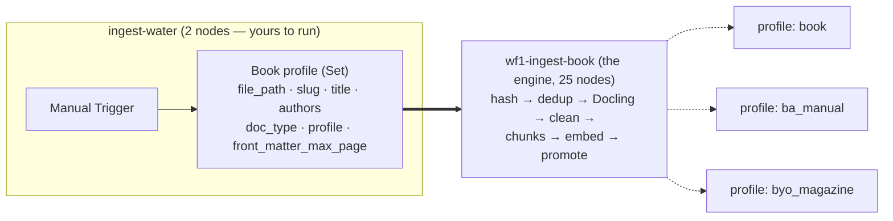

# Phase 3 — the corpus, rebuilt one source at a time

**Status:** 🟢 **0a built 2026-08-07** · 🟡 **0b built and Tier-A verified 2026-08-12, A/B not
run** · **Written:** 2026-08-07
**Prereqs:** none for 0a. Books 0b–9 need 0a's schema and engine, both of which now exist.

> ## 🟡 Where the corpus actually stands — measured 2026-08-12
>
> | | Measured |
> |---|---|
> | `kb.chunks` | **679** — *How to Brew* **447** + BJCP style cards **232** (variant B) |
> | embedding gaps · dims · `is_current` versions | **0** · **1024** · **2** |
> | `ref.styles` | **116** BJCP 2021 rows · 96 with vitals · 20 without · 30 entry instructions |
> | n8n workflows | **3** — `wf1-ingest-book`, `ingest-how-to-brew`, `ingest-bjcp-styles`, all exported and committed |
>
> **Three things are done that this README previously listed as outstanding:** the
> `ingest-how-to-brew` launcher exists, the styles workflow exists, and every workflow JSON
> is tracked. **Three are still open, and they are the ones that produce evidence rather than
> artefacts:**
>
> | Open | Why it still matters |
> |---|---|
> | ⛔ **§5.5's A/B never ran** | only variant **B** was executed — no A0, no A. B is deployed by default, not by measurement, so **D32b is still open** |
> | ⛔ **A5, the repair ledger** | *How to Brew* was genuinely re-ingested on 2026-08-12 and reproduced 447 chunks with the drop ledger matching exactly — but node 26 still lacks `$5`, so `detail->'repairs'` came back empty. The chance was there and was missed; the next one is a deliberate re-ingest |
> | ⛔ **Tier B has never been recorded** | there is still **no standing-question baseline**, and the corpus has changed twice since 0a. Book 1 has nothing to regress against until five `ask.sh` calls are run and written down |
**This is the only live plan.** Everything before it is in
[`plans/archive/`](../archive/README.md), indexed by what is still true.

> ## 🔴 D33 — full reset, executed 2026-08-07
>
> **Decision (yours, 2026-08-07): purge the database and the workflows, and rebuild from
> zero against a schema designed for the whole corpus rather than for two documents.**
>
> This was **executed, not planned.** State as of now:
>
> | | Before | After |
> |---|---|---|
> | `kb` · `brew` · `mem` · `nlq` schemas | 563 chunks, 563 embeddings, 116 styles | ⛔ **dropped** |
> | `public.n8n_chat_histories` | chat memory | ⛔ dropped |
> | n8n workflows | 5 (`HowToBrew`, `Digestion`, `chat-agent`, 2 tools) | ⛔ **0** |
> | n8n credentials | 3 | ✅ **kept** — `Postgres account`, `n8n_agent`, `Ollama account` |
> | DB roles `n8n_agent` / `agent_ro` / `mem_writer` | exist | ✅ kept (cluster-level; `50_roles.sql` re-grants) |
> | Extensions `vector` / `pg_trgm` / `unaccent` | installed | ✅ kept |
> | Ollama models `gemma4:12b` / `bge-m3` | resident | ✅ untouched |
>
> **Backup before purge:** all 5 live workflows exported to
> `backup/n8n-workflows-20260807-085702/`. Node counts verified identical to the tracked
> JSON in `n8n/demo-data/workflows/` (25 / 18 / 5 / 6 / 1). **System prompt v3 confirmed
> present in three independent places** — the backup, the tracked JSON, and
> [`archive/phase2/03-wf4-design.md`](../archive/phase2/03-wf4-design.md) §6 — before
> anything was deleted.
>
> ✅ **Resolved by book 0a.** The `db/init` files were rewritten for D32 first, then applied.
> All five schemas — `kb` `ref` `brew` `mem` `nlq` — now exist, and `db-init` is safe to
> re-run. The warning this paragraph used to carry (*"do not re-run db-init, it would
> recreate the old schema"*) no longer applies.
>
> **Why this was the right moment.** Everything in that database was reproducible from
> files on disk — `how_to_brew_john_palmer.pdf` and `styles.json` — and `brew`, `mem` and
> `chat_turns` were all empty. There was nothing to lose and a schema anomaly to fix
> (§5.4). It gets strictly more expensive after every book.
>
> **What it settles:** D32 loses its only counter-argument. The case for keeping
> `brew.bjcp_styles` was incumbency — existing rows, an existing FK. Both are gone, so the
> question reduces to *"what would you design fresh?"*, and that is `ref`.
> **D32 is therefore taken as accepted.**

> ⚠️ **Naming collision.** Architecture §11 has a *"Phase 3 — Full tool set and NLQ"*.
> This is **not** that. **Recommendation:** split §11 into **3a — corpus (this folder)**
> and **3b — tools and NLQ**, and do 3a first. Adding tools to a thin corpus measures the
> tools; adding books to a one-tool agent measures retrieval; doing both at once measures
> nothing. That is §10.3's "one variable" rule at phase granularity.

§6 is the **contract**: when you ask for *"the detailed plan for Water"*, §6 is what
gets followed.

---

## 1. Where things stand

| Change | Effect |
|---|---|
| **Everything purged** (D33), then **books 0a and 0b rebuilt it** | 🟢 five schemas live; `wf1-ingest-book` + `ingest-how-to-brew` + `ingest-bjcp-styles` built and committed; **679 chunks** — *How to Brew* 447 and 232 style cards. §1.3 tracks what is back and what is still outstanding |
| *Radical Brewing* removed from `pending/` | ✅ closed. The file was a 3-page ad, not a book. **It must also come out of the corpus doc's ingredient/process table** — the coverage map is what the agent's refusal behaviour depends on, so a book listed but not ingested is worse than one that was never listed |
| `byo_pastry_stouts.md` added | ✅ reviewed, reformatted, and now **book 8** |
| `Beer_faults.pdf` transcribed to `beer_faults.json` | ✅ **book 6**, and much easier than the first draft claimed. §2 |

### 1.3 The rebuild inventory — what must exist again, and from what

Nothing here is lost work; all of it is reproducible. Listed so that "rebuild from zero"
is a checklist rather than a feeling.

| # | Thing | Rebuilt from | Where it lands |
|---|---|---|---|
| 1 | ✅ `ref` · `kb` · `brew` · `mem` · `nlq` schemas | `db/init/*.sql`, **edited for D32 first** | **done** — all five live; `15_ref.sql` added to the compose file list |
| 2 | ✅ **`wf1-ingest-book`** — the engine, **26 nodes** | rebuilt per [`00a-rebuild.md`](00a-rebuild.md) §2.2, minus every book constant (D30) | **done** — 13-field input contract |
| 3 | ✅ `ingest-how-to-brew` launcher (2 nodes) | new — [`00b-styles.md`](00b-styles.md) §P.1 | **done 2026-08-12**, id `BAe1fP1g7ZUsbIaq`, exported and committed. D30's per-book pattern now exists for books 1–9 to copy |
| 4 | ✅ *How to Brew* corpus | the PDF, through #2 | **done — 447 chunks**, 0 embedding gaps, §1.4. Re-ingested 2026-08-12 after a `kb` truncate and **reproduced 447 with the identical 36-drop ledger** — the fixture has now held twice, through two independent builds |
| 5 | ✅ **`ref.styles`** import + card generator | `styles.json`, all 11 prose fields | **done 2026-08-12** — `ingest-bjcp-styles`, 22 nodes, id `Ejf3ESE3SK1XBqe3`. 116 rows, 232 cards (variant B). ⛔ **the card-format A/B did not run** — see [`00b-styles.md`](00b-styles.md) §5.4 |
| 6 | `tool-search-brewing-knowledge` | `backup/…/QNAqwfeQyHLxtjZr.json` — 6 nodes, was working | after book 0b |
| 7 | **WF4 `chat-agent`** | `backup/…/ztLTT3xiKT8eCSfh.json` + [`archive/phase2/03b`](../archive/phase2/03b-wf4-build-guide.md). **System prompt v3 verbatim from [`archive/phase2/03-wf4-design.md`](../archive/phase2/03-wf4-design.md) §6**, with §7.1's de-enumeration edit | after book 0b |
| 8 | `Prep turn` / `Log turn` → `mem.chat_turns` | never built; carried from the archive as an open item | with #7 — build it this time |
| ⏸ | `tool-find-batches` | 1-node stub, parked by D25 | **do not rebuild** |

**Rebuilding WF4 is not a regression.** It was 5 nodes, it is fully documented, and the
rebuild is where the two things the old one lacked — turn logging (#8) and the
de-enumerated system prompt (§7.1) — get built in rather than retrofitted.

### 1.4 *How to Brew* is now a regression fixture, and that is the point

The single best consequence of the purge. Its previous ingest was measured: **447 chunks,
100% embedding coverage at 1024 dims.** Re-running it through the rebuilt engine is
therefore a **test with a known answer**:

> **If book 0a does not reproduce ~447 chunks with 0 embedding gaps, the D30 engine split
> is wrong — and you know it before touching a new book.**

✅ **Result, measured 2026-08-07: 447 chunks, 0 embedding gaps, 1024 dims, 1 `is_current`
version — exact, not approximate.** The D30 split holds: a rebuilt 26-node engine carrying
no book constants reproduced a fixture produced by a workflow full of them. The drop ledger
also matches at 36 (front matter 18, References 16, source-specific 1, token floor 1).

The original plan proved the engine on Water, where there is no prior to compare against.
This is strictly better, and it is why *How to Brew* is re-ingested first rather than
treated as something merely lost.

⚠️ **This could not have been rehearsed before the purge.** Dedup on `file_sha256` would
have stopped the re-run at `Is new file?`. The order genuinely has to be purge → build →
verify, and the worst case is an empty corpus until the engine works.

### 1.1 Correction: the fault list extracts perfectly

The first draft of this plan called `Beer_faults.pdf` *"the hardest single extraction in
the set"*. **That was wrong, and the fix is one flag.** Plain `pdftotext` interleaves the
two columns into unusable order; `pdftotext -layout` reproduces the table exactly —
21 faults, each with its descriptors and its remedy list, no ambiguity anywhere.

So the answer to *"is it really not understandable?"* is **no — it is completely
readable**, and **you should not hand-type it.** A hand-transcription of 21 rows of
dense remedy text is twenty minutes and a real chance of a typo in exactly the kind of
content where a typo is invisible. It has been generated instead:

**`shared/rag-files/pending/beer_faults.json`** — 21 faults, validated as parseable, every
row populated. Schema per row: `name`, `descriptors[]`, `solutions`.

Two things to know about it:

- **Markdown would have been the wrong target.** This is structured data headed for a
  `faults` table (§4 book 6), and JSON is what the existing structured path already
  consumes (`styles.json`, D17). A markdown table would just have to be re-parsed.
- ⚠️ **There is no `cause` column, because the source has none.** The BJCP table is
  exactly two columns — *Characteristic* and *Possible Solutions*. The corpus doc
  describes this source as an *"off-flavor → cause → remedy mapping"*; it is really
  off-flavor → remedy, with causes implicit. **Do not let anything infer the causes** —
  that is precisely the fabricated-numbers failure the closed-book design exists to
  prevent. Causes for the major faults are genuinely covered by *Yeast* and *How to Brew*,
  which is where they should come from, attributed.

**Your job now:** spot-check the JSON against the PDF. Five minutes, and it is the only
verification step that a generated transcription needs.

### 1.2 `byo_pastry_stouts.md` — reviewed

**The content is correct and complete.** All three contributors, all their numbers intact
(30–31 °P, 152–154 °F, WLP066, OYL-052, 158 °F / pH 5.4, 10–14% ABV, Chico). Nothing was
added, removed, or rewritten. Two things were fixed, both about how it will chunk:

| Fixed | Why it mattered |
|---|---|
| **Heading hierarchy.** Was `#` → `###` with the middle level missing, and each pro's ~900-token section was one flat block. Now `#` → `##` per pro → `###` per topic (*Base recipe and gravity*, *Adjunct additions*, *Yeast selection*, …) | `HybridChunker` builds `heading_path` from headings and **embeds the heading path with the body**. Flat sections would have produced chunks embedded as *"Ben Romano, Angry Chair Brewing / …"* with no indication they were about yeast or barrels. This is the same anonymity failure that dominated the stout guide probe — cheaper to prevent in a source file you control than to repair in a cleaning node |
| **Provenance line + trailing whitespace** | Citations need a source; and the article is **practitioner opinion**, not reference text, which requirement §5.6 says must be distinguishable. The italic line under the title states both |

The topic sub-headings are groupings of the article's own paragraphs — no sentence was
moved between sections and no wording changed. If you would rather the file stay
byte-faithful to the original, say so and the grouping moves into the cleaning profile
instead; it costs a slightly more complex node and gains nothing else.

---

## 2. Answers to the five rules you set

| # | Your rule | Recommendation | State |
|---|---|---|---|
| 1 | Research crossovers / overlapping data | **Don't deduplicate. Scope at ingest, measure retrieval share, hold a per-document cap in reserve.** Full reasoning §3 | proposed as **D31** |
| 2 | Decide the order | **Styles model → Water → Yeast → Malt → Draught → BA 2026 + Study Guide → faults → hops → pastry stouts → stout guide.** §4 | ✅ set |
| 3 | A detailed plan per book | **One plan per source at `plans/phase3/<NN>-<slug>.md`**, produced on request, following §6 | ✅ contract written |
| 4 | Each plan: step-by-step build, why each node, small test cases | §6 — nine fixed sections, three tiers of tests, probe-before-plan | ✅ contract written |
| 5 | One workflow per book | **✅ accepted your call: one shared engine.** §2.1 | ✅ settled — **D30** |

### 2.1 D30, settled: one engine, one thin launcher per book

You were right to question it and right to drop it. **The books do not need different
processing — they need different *constants*, and one of them needs a different cleaning
profile.** That is a parameter, not a workflow.

The shape:



`HowToBrew` is renamed **`wf1-ingest-book`**, gains an Execute Workflow Trigger, and loses
every book constant. Each source gets `ingest-<slug>` — its own name in the workflow list,
its own Run button, its own tracked JSON — and is **two nodes**, which is what makes a
per-book plan readable rather than a 25-node re-run.

**Where "slightly different processing" actually lives:** the `profile` field on the
launcher selects a branch in the cleaning node. Three profiles cover all nine sources
(`book`, `ba_manual`, `byo_magazine`). Adding a fourth is ~20 lines in one place, not a
new graph.

**The three structured sources (faults, hops, styles) do not use the engine at all** —
they parse rather than chunk, per architecture §6.6, and are genuinely their own
workflows. No reconciliation needed there.

---

## 3. Crossovers and overlapping data

**The question:** *How to Brew* has a water chapter; *Water* is 273 pages on it. Three
sources define Irish Stout. Four describe diacetyl. Detect, deduplicate, or rank?

### 3.1 The overlaps, named

| Overlap | Sources | Kind | Severity |
|---|---|---|---|
| **Style definitions** | BJCP 2021 cards *(in corpus)* × BJCP Study Guide × BA 2026 × stout guide | **near-duplicate text**, tight embedding cluster | ⛔ **high** — §5 |
| Off-flavours | fault list × How to Brew × Yeast × Draught manual | same topic, different depth | ⚠️ medium |
| Water chemistry | How to Brew ch.15 × Water | same topic, wildly different depth | ⚠️ medium |
| Malt / yeast basics | How to Brew × Malt × Yeast | same | ⚠️ medium |
| Stout brewing | stout guide × pastry stouts | complementary — recipes vs. practitioner method | ✅ low |
| Hop specs | hop handbook (table) × How to Brew (prose) | complementary | ✅ low |

**Almost none of this is textual duplication.** Four books on diacetyl share concepts and
vocabulary, not strings. That single observation decides the policy.

### 3.2 The principle

Two different things get called "overlap", and separating them gives one rule that
resolves both D31 and D32:

| | | Verdict |
|---|---|---|
| **(a) Topical overlap** | four books explain diacetyl, in different words, at different depths, by different authors | ✅ **keep, unconditionally** |
| **(b) Representational duplication** | the *same assertion* stored twice in two shapes — a style's OG range as a numeric column *and* as prose in a card | ⛔ **defect — unless one is generated from the other** |

> **Never drop distinct explanation. Never store the same assertion twice unless one side
> is derived from the other.**

**Why (a) is not negotiable.** It is corroboration and disagreement, not redundancy, and
it is most of what the corpus is worth. Palmer's water chapter and the Palmer/Kaminski
book are the 20-page answer and the 273-page answer; which is correct depends on the
question. Drop the shallow one and every water question becomes a chemistry lecture; drop
the deep one and the assistant cannot go deep.

The asymmetry that makes this a rule rather than a preference: **an ingest-time deletion is
irreversible and untargeted; a query-time filter is reversible and per-question.** You can
always suppress at query time what you kept. You can never retrieve what you dropped. So
the default is keep-and-fix-retrieval unless storage or precision forces otherwise — and
at ~3,100 chunks neither does.

**Why (b) is a defect.** The same fact in two places drifts. The existing style-card design
already dodges this: the card is an `INSERT … SELECT` from the numeric row, so the two
*cannot* disagree. Derived duplication is fine; parallel duplication is a bug.

Layers 0 and 1 below are this one principle applied to (a) and (b) respectively — they are
not in tension.

### 3.3 The policy — four layers, cheapest first

**Layer 0 — never deduplicate across sources.** `file_sha256` and `content_sha256`
already catch byte- and chunk-identical content, and across two different books they will
essentially never fire, correctly. An *embedding-similarity* near-dup pass would delete
exactly what requirement §5.5 demands — *"where sources disagree, present both rather than
averaging them."* You cannot present both positions if ingest deleted one. The
[conflicting-evidence literature](https://arxiv.org/abs/2504.13079) draws the same line:
conflict from **ambiguity** should surface as multiple valid answers; only conflict from
**noise or misinformation** should be filtered. This corpus is entirely the former.

**Layer 1 — prevent overlap at ingest, by scoping.** The real lever, and it costs nothing
at query time. Where a source is structured and already represented, do not add a second
prose representation of the same rows — that is (b), and it is a defect. §5 is this layer
applied to the worst case in the corpus.

**Layer 2 — measure concentration, not duplicates.** Two numbers per source:

| Metric | Signal to act |
|---|---|
| **corpus share** — `count(chunks)` / total, per document | any document > **25%** |
| **retrieval share** — over the 10 probe questions, how many of top-6 come from one document | **≥ 3 of 6** from one document on a question it does not own |

Retrieval share is the one that matters; corpus share is the cheap proxy plan 06 uses.

**Layer 3 — only if Layer 2 fires: a per-document cap in the fusion.** MMR is the textbook
answer and the wrong first move — it needs candidate vectors carried into the fusion stage
and a tuning constant you have no evidence to set. The cheap 80% is
`row_number() OVER (PARTITION BY d.id ORDER BY f.score DESC)` inside
`nlq.search_knowledge`, keeping at most 3 of 6 per document. ~5 lines, additive, no
re-embedding, no new parameter the model can get wrong. §10.4's discipline, applied to a
new row.

**Layer 4 — authority is metadata, never a ranking boost.** Add
`kb.documents.authority` (`reference` | `guideline` | `practitioner`), nullable, and
surface it in the tool's passage header so the model can write *"Palmer suggests X;
Mallett frames it as Y"* — or *"Angry Chair's practice is X, which is opinion, not
reference."* **Do not rank on it.** Ranking by authority suppresses the disagreement the
design exists to surface, and does it invisibly: you would never see the passage that
lost. Requirement §5.6 is a *presentation* requirement; solve it in presentation.

> **D31 (proposed).** No cross-source deduplication. Overlap is controlled at ingest by
> scoping (Layer 1) and measured by retrieval share (Layer 2). The per-document cap
> (Layer 3) is the designated fix and is built **only** when Layer 2 fires.
> `kb.documents.authority` is presentation metadata and never enters ranking (Layer 4).
>
> **Decide by book 5, not book 1** — corrected 2026-08-07. Layers 0–2 change no schema and
> cost nothing; Layer 3 is deferred by construction. Books 1–4 (Water, Yeast, Malt,
> Draught) each own their topic and present no scoping choice, so there is nothing for
> D31 to gate until the style sources arrive.
>
> ✅ The one piece with an earlier deadline is **done**: `kb.documents.authority` was added
> at book 0a and *How to Brew* carries `reference`. `nlq.search_knowledge` already returns
> the column — added while it had zero callers, because `CREATE OR REPLACE` cannot change a
> function's return type later. Populate it per source from here on.
>
> **The line worth your attention is one sentence: authority never enters ranking.** It is
> the rule most likely to be violated later in good faith — *"Palmer is the reference, boost
> him"* — and doing so suppresses the disagreement the design exists to surface, invisibly.
> You would never see the passage that lost.

### 3.4 Deferred: `process_stage` and `style_scope`

Both are asked for by the corpus doc, both are genuinely useful, and both are deferred for
one reason: they need an LLM classification pass over every chunk and **nothing queries
them** — `nlq.search_knowledge` has no parameter for either. They are also cheap to add
later: a nullable column and an `UPDATE`, no re-chunking, no re-embedding.

**Build them when:** an answer needs several process stages and retrieval keeps returning
three chunks about the mash. That is measurable. Wait for it.

---

## 4. The order

> **The principle: earn the right to change the pipeline.** Group 1 changes nothing but a
> Set node, three times, and produces the evidence that decides everything after it.

| # | Source | Path | New capability exercised | Est. |
|---|---|---|---|---|
| **0a** | ✅ **Rebuild** — `db/init` with `ref` → engine → *How to Brew* | new schema + `wf1-ingest-book` | the D30 split, tested against a **known answer: 447 chunks** — ✅ **reproduced exactly**. §1.4 | ~4 h |
| **0b** | 🟡 **Styles model** — `ref.styles` + widened `styles.json` import | new WF — ✅ built, [`00b`](00b-styles.md) | one styles model ✅ **116 rows, 232 cards**; the card-format A/B (§5.5) ⛔ **not run** | ~3 h |
| **1** | **Water** — Palmer & Kaminski, 273 p | engine, `profile: book` | the D30 split itself, on the easiest possible file | ~90 min |
| **2** | **Yeast** — White & Zainasheff, 325 p | engine, `profile: book` | nothing — should be near-free | ~40 min |
| **3** | **Malt** — Mallett, 335 p | engine, `profile: book` | table-dense body under `table_mode=accurate` | ~50 min |
| **4** | **Draught Beer Quality Manual**, 124 p | engine, **new** `profile: ba_manual` | two-column layout; first new cleaning profile | ~90 min |
| **5** | **BA 2026** + **BJCP Study Guide** | new WF rows + engine | extra sources into the model book 0 built. §5 | ~3 h |
| **6** | **Beer Fault List** — `beer_faults.json`, 21 rows | **new WF** | the structured path, on already-clean data | ~2 h |
| **7** | **Hop Variety Handbook**, 44 p | **new WF** | `hops` table; extraction from repeating PDF spec cards | ~3 h |
| **8** | **BYO Pastry Stouts** — markdown, ~2,300 words | engine, `profile: book` | **first non-PDF input** — does the engine take `.md`? | ~45 min |
| **9** | **Stout Style Guide**, 84 p | engine, `profile: byo_magazine` | [archived plan 06](../archive/06-stout-guide-ingest.md), already written and probed | ~2 h |

### 4.1 Why this order

**The styles model first — revised 2026-08-07, and this reverses the first draft.** It was
book 5; it is now book 0, for one reason that outweighs the rest: **the 116 style cards are
already in `kb.chunks`, competing in every retrieval, and the standing regression questions
hit them.** Reworking styles at book 5 would invalidate the baseline books 1–4 were measured
against, splitting the sequence into "before styles" and "after styles" — the exact
moving-target failure this plan warns about everywhere else. Doing it first costs **one
clean re-baseline at the start** instead.

Three supporting reasons: it is the cheapest it will ever be (116 rows, **no consumer** —
`lookup_bjcp_style` is unbuilt); it is a different workflow from the engine, so it does not
delay the D30 split; and it is the only piece of *already-built* work that is actually
wrong, which is what the reset was for.

It also splits cleanly: the schema plus the BJCP 2021 re-import is book 0 (~2 h), and
BA 2026 + the Study Guide land at book 5 as additional rows into a model that already
exists (~3 h) — instead of one five-hour job.

**Water first, because it is the easiest hard thing.** Closest twin to the one book
already ingested — single-column prose, calibre-produced, 273 pages against 248 — so the
D30 split is proved on a file where a failure means *the split is wrong*, not *the file is
weird*. It is also the largest genuine coverage gap: water chemistry is listed as a
strength and the corpus has one Palmer chapter of it.

**Yeast and Malt next, because they should cost almost nothing.** If they don't, the
parameterisation is broken and you want to learn that on book 3 of 9, not book 8. Three
books of one shape is also the smallest sample that shows whether the engine generalises —
one proves nothing, two is a coincidence.

**Draught fourth: a format change on a topically disjoint file.** The first new cleaning
profile since the stout guide, and the manual is the only source covering dispense — so if
the profile mangles something, no existing answer degrades. Format risk and overlap risk
are separated deliberately.

**BA 2026 and the Study Guide fifth, into a model that already exists.** They are the two
sources with real scoping decisions, so they wait for D31 and for the retrieval-share
evidence from four clean books. Splitting them from book 0 also keeps them apart from each
other in the right way: BA 2026 is structured rows, the Study Guide is prose scoped to
rationale — different paths, and running them back to back would change two variables.

**Faults before hops.** The fault list's source data is now clean JSON, so it exercises the
structured path — parse → assert → upsert → generate cards → embed — with the extraction
problem already solved. The hop handbook does the same path *plus* a real extraction from
44 pages of PDF spec cards. Do the easy half first.

**Pastry stouts eighth, right before the stout guide.** It is the first non-PDF input, so
it is a variable of its own and belongs alone; and it is the same topic as book 9, so the
two should be evaluated together. It is also 45 minutes.

**Stout guide last — and this is the change plan 06 wants.** Plan 06 §6 calls corpus
balance *"the thing to watch, and it is bigger than any node in §3"*: 218 merged chunks
against today's 563 is **28%** of the corpus, with a rollback rule already drafted for it.
Against ~2,900 it is **~7%**. Same file, same chunks, a third of the risk — bought purely
by running it ninth. Plan 06 needs no rewrite, only a note that its percentages assume it
runs first.

### 4.2 Projected corpus

Extrapolated from the one measured book (248 p → 447 chunks) and plan 06's probe:

| | chunks | running total |
|---|---|---|
| **0a+0b — measured 2026-08-12** — How to Brew **447** + BJCP cards **232** (variant B) | **679** | **679** |
| **1–3** Water · Yeast · Malt | ~490 · ~590 · ~600 | ~2,359 |
| **4** Draught manual | ~250 | ~2,609 |
| **5** BA 2026 cards + Study Guide prose | ~100 · ~130 | ~2,839 |
| **6–7** faults · hops | ~21 · ~110 | ~2,970 |
| **8** pastry stouts | ~12 | ~2,982 |
| **9** stout guide | 218 | **~3,200** |

**The first row is now measured, not projected**, and it landed at the top of the
563–679 range this table used to straddle, because variant B is deployed. If the A/B is run
and A0 or A wins, the corpus drops by 116 and every later total with it.

**~3,100 chunks.** Architecture §3.6 sized pgvector for 40–60k and called 500k
comfortable, so **do not let corpus growth become an infrastructure conversation.** The
thing that degrades is top-6 competition — §3 — and it degrades silently (R5).

---

## 5. ⭐ The styles rework — your BJCP question, answered

You said you think the BJCP guidelines should be added again, rethought, maybe elsewhere
in the DB and in another format. **Agreed, and now is the cheapest moment it will ever
be.** Here is the case and the proposal.

### 5.1 What is wrong with the current shape

Today (D17): `styles.json` → 116 rows in **`brew.bjcp_styles`** + 116 generated style
cards in `kb.chunks`. Three problems, in increasing order of importance:

1. **It is in the wrong schema.** `brew` is *"truth — what I actually did"* (§3.1). BJCP is
   *"what a reference says"*, which is knowledge. Architecture §3.5 admits the case is
   awkward and put the numeric side in `brew` anyway. With two more style sources arriving,
   that compromise stops being harmless.
2. **The name encodes one source.** `brew.bjcp_styles` cannot hold BA 2026 without either
   lying about its name or fighting `ON CONFLICT (guide_year, code)`. Two guides, two
   numbering systems, overlapping style names.
3. ⛔ **Three sources will produce three prose descriptions of Irish Stout.** They will
   cluster tightly in embedding space, and a top-6 that returns three of them has spent
   half its budget saying the same thing three ways. This is the highest-probability
   retrieval defect in the whole plan, and Layer 1 is the only place to stop it cheaply.

**And the cost of changing it is near zero right now**, which is the decisive fact:
**nothing reads the numeric table.** `lookup_bjcp_style` is Phase 3b, unbuilt. 116 rows,
no consumer. Re-import is a JSON parse, not a Docling run — minutes, not hours. This gets
strictly more expensive every week it waits.

### 5.2 The three representations, kept straight

Being precise about which representation is which is what makes the overlap disappear:

| | Form | Retrieval | Answers |
|---|---|---|---|
| **Numeric ranges** | real columns, one row per `(guide, guide_year, code)` | **SQL only — never embedded** | *"is my 1.048 in range for 15B?"* — a `BETWEEN`, not a retrieval gamble |
| **Narrative** | one **or two** cards per `(guide, style)` — §5.5's A/B — **generated from the row** | embedded | *"what's the difference between a porter and a stout?"* |
| **Causation prose** | ordinary chunks — the Study Guide's *why* | embedded | *"why does an Irish Stout read roasty rather than burnt?"* |

The overlap rules fall straight out of §3.2's principle:

- **Numeric + card coexist** because the card is *derived* — they cannot drift. Derived
  duplication is fine.
- **Two guides coexist** because they are different assertions by different bodies. Where
  BJCP 15B and BA's Irish-Style Dry Stout disagree on numbers, **that disagreement is
  information** — surface both, attributed. Layer 4, not a deduplication problem.
- ⛔ **Two cards for one style that say the same thing** is the actual defect — and the
  Study Guide's vital-statistics tables restating BJCP numbers as prose is the same defect
  in different clothes. Both get dropped.

  ⚠️ **This is not what §5.5's variant B does, and the distinction is the whole principle.**
  A sensory card and a context card carry **disjoint fields** — no sentence appears in
  both. That is one assertion split across two chunks, which is fine. Two cards would only
  be a defect if they *restated* each other. Splitting ≠ duplicating.
- The Study Guide is therefore the **one style source that goes through the prose engine**,
  not the structured path. Its rationale is genuinely unique content; nothing else in the
  corpus has it.

### 5.3 The proposal

**One styles model, all sources as rows.**

| Change | Detail |
|---|---|
| **Move and rename** | `brew.bjcp_styles` → **`ref.styles`**, keyed `(guide, guide_year, code)`. `guide` ∈ `BJCP`, `BA`. Numeric ranges stay real columns and stay **nullable** — see §5.4 finding 2 |
| **Widen the row** | the current table imports **6 of the 11 prose fields** in `styles.json`. Add `history`, `characteristic_ingredients`, `style_comparison`, `entry_instructions`, `tags[]` — see §5.4 finding 3 |
| **Cards per style** | ⚖️ **decided by measurement, not argument — §5.5.** Whatever wins, they are regenerated by the same `INSERT … SELECT`, so the row and the card still cannot drift (§3.5's actual good idea, preserved) |
| **The dedup rule** | ⛔ **never two cards for the same style within a guide**, and cross-guide cards must differ in heading path so they are distinguishable in a citation. *"BJCP 2021 15B Irish Stout"* and *"BA 2026 Irish-Style Dry Stout"* are different claims by different bodies and both are legitimate — that is Layer 4, not Layer 0 |
| **BJCP Study Guide** | scoped to **rationale prose only** — *why* a style tastes as it does. Its vital-statistics tables are dropped as duplicates of the cards. This is the source's genuine unique value and nothing else in the corpus has it |
| **Repoint the FK** | `brew.recipes.style_id` → `ref.styles(id)`. See §5.4 finding 1 |

**Rollback is the whole point of doing it now:** the current 116 rows and 116 cards are
reproducible from `styles.json` by re-running the import. There is nothing to lose.

⚠️ **One implementation note not to forget:** `n8n_agent` holds rights on `nlq` and nothing
else (§8.4). `ref.styles` is therefore unreachable by the agent until an `nlq` view or
function exposes it — same as every other table, but easy to overlook when
`lookup_bjcp_style` lands in Phase 3b.

### 5.4 Three findings from the live data and schema

Measured 2026-08-07 against `db/init/20_brew.sql`, `styles.json` (116 styles) and the
tracked `wf2-digestion.json`. Each one moved the design.

**Finding 1 — it is not consumer-free. There is an FK.**
`brew.recipes.style_id` references `brew.bjcp_styles(id)`
([`db/init/20_brew.sql:56`](../../db/init/20_brew.sql)). The table is empty, but the
dependency is structural, and it is why the target is **`ref.styles` and not `kb.styles`**:
a `brew → kb` foreign key points the wrong way across the boundary the design protects.

**Why a `ref` schema rather than either.** There is a standing anomaly today —
deprecation #12 forbids embedding anything from `brew.*` into `kb.*`, and §3.5's card
generator does exactly that as a deliberate carve-out, because `brew.bjcp_styles` is the
one table in `brew` that is not *"what I actually did"*. **Published reference data is a
third category, and three of the nine sources are it: styles, hops (book 7), faults
(book 6).**

```sql
CREATE SCHEMA ref;   -- published reference data: not my brewing, not prose
```

| Gain |
|---|
| Deprecation #12 becomes **absolute again** — nothing from `brew` ever reaches `kb`, no carve-out |
| `ref.*` → generated cards in `kb` is clean by construction |
| `brew.recipes.style_id → ref.styles(id)` reads correctly: a recipe references a reference table |
| **Hops and faults get a home before books 6 and 7 each invent one ad hoc** |

Cost: a fifth schema. Real but small — the agent only ever touches `nlq`, so the grant
model does not change at all. Conceptual cost, structural gain.

**Finding 2 — 20 of the 116 styles have no vital statistics.**
Every specialty category (`27A`–`34C`: Historical Beer, Alternative Fermentables,
Wood-Aged, Specialty IPA…) ships with no OG/FG/IBU/SRM/ABV, because those vary with the
base style. The columns are nullable and that is correct.

✅ **The card generator already handles this** — `CASE WHEN s.og_min IS NOT NULL` omits the
vitals line entirely. Nothing to fix there.

⚠️ **The lookup path does not exist yet, and this is where it will break.** A model handed
`og_min = null` will render **"OG 0.000"** without hesitation. Add a generated column and
branch on it rather than trusting null handling:

```sql
has_vitals boolean GENERATED ALWAYS AS (og_min IS NOT NULL) STORED
```

`lookup_bjcp_style` (Phase 3b) must say *"this style defines no vital statistics"*
explicitly. Recorded here because that is the plan that will be written months from now.

**Finding 3 — the import throws away five prose fields.**
`styles.json` carries 11 prose fields; the table has columns for 6. Discarded today:
`history`, `characteristicingredients`, `stylecomparison`, `entryinstructions`, `tags`.

`stylecomparison` is literally *"how does this differ from X"* — among the most-asked style
questions — and it is dropped at import. `tags`
(`session-strength, dark-color, britishisles, brown-ale-family, malty`) is free FTS fuel.

### 5.5 ⚖️ The card format is decided by measurement — the A/B

**Decided 2026-08-07 (your call): build each variant, measure it, keep the winner.** The
argument for splitting the card is a retrieval bet, not a correctness fix, and this plan's
own rule is that bets get measured. What follows is the protocol, written **before** the
run so the decision rule cannot be chosen after seeing the numbers.

**Card sizes, measured over all 116 styles:**

| Variant | Fields | Median tokens | Max | 6 cards in context |
|---|---|---|---|---|
| **A0** — status quo, deployed | 6 prose fields, 1 card | ~460 | ~925 | ~2,760 |
| **A** — widened | all 11 fields, 1 card | **~667** | ~1,260 | **~4,000** ⚠️ over the ~3,000 budget |
| **B** — widened + split | all 11 fields, **2 cards** | **~330** | ~630 | ~1,980 |

- **sensory card** — overall impression, aroma, appearance, flavor, mouthfeel
- **context card** — history, style comparison, characteristic ingredients, commercial
  examples, entry instructions, tags

**Three runs, not two — because A0 → A → B isolates one variable each.** Testing A against
B alone confounds *"do the extra fields help"* with *"does splitting help"*, and §10.3's
rule is one variable per run.

| Run | Variable under test |
|---|---|
| A0 → A | **do the five missing prose fields help?** |
| A → B | **does splitting the card help?** |

#### How to run it — sequentially, in place

⚠️ **The two variants cannot coexist in the corpus.** `kb.document_versions` carries
`UNIQUE (file_sha256)`, and both variants are generated from the same `styles.json`, so
they hash identically. This is the same constraint plan 06 §8.2 hit.

**That is fine, because `ingest-bjcp-styles` is built to be re-run in place** — see
[`00b-styles.md`](00b-styles.md) §2, nodes 10 and 11. `Ensure KB doc + version` uses
`ON CONFLICT (file_sha256) DO UPDATE … RETURNING id`, so a re-run **reuses the same
`version_id`** and records the variant in `chunker_config`; `Demote + clear old cards`
demotes the version and deletes its chunks (embeddings cascade) before regeneration. So the
loop is:

1. set the `variant` field on the `Card variant` node — `A0`, then `A`, then `B`
2. re-run the workflow — cards are cleared and regenerated, embeddings follow
3. run the probe set, record
4. repeat

⚠️ **The variant is a launcher field, not an edit to the card SQL.** Hand-editing a 60-line
`INSERT … SELECT` three times makes the thing under test also the thing being modified three
times, and the export then records only the last paste. As a field it lands in
`kb.document_versions.chunker_config`, so *"which variant produced these cards"* stays
answerable from SQL.

Each cycle is **~2–5 minutes measured-adjacent** (variant B ran in that band on 2026-08-12):
a JSON parse and 116–232 embeddings, no Docling. **No rollback SQL is needed** — the next run
overwrites.

#### The probe set — 8 questions, 4 of each kind

The set has to *discriminate*. Sensory questions should be indifferent to the split;
context questions are where B should win if it wins at all.

| | Sensory | Context / comparison |
|---|---|---|
| 1 | what should an Irish Stout taste like | what is the difference between a porter and a stout |
| 2 | what aroma is expected in a Dark Mild | where did Dark Mild come from |
| 3 | how should a Doppelbock look and feel in the mouth | what commercial examples are there for Irish Stout |
| 4 | what mouthfeel is right for an Oatmeal Stout | which ingredients are characteristic of a Munich Helles |

Run each with `scripts/ask.sh`; record **hit@1** and **hit@3** — does the correct style's
card come back, and at what rank. Plus the **5 standing regression questions** from
[`02-phase1-retrieval-gate.md`](../archive/02-phase1-retrieval-gate.md), because a card
change alters what every book question competes against.

#### The decision rule, fixed in advance

| Comparison | Keep the new variant if |
|---|---|
| **A0 → A** | context questions improve on hit@3 **and** sensory questions do not regress. If the extra fields help nothing, stay at A0 and the split question is moot |
| **A → B** | context hit@1 improves by **≥ 2 of 4** with no sensory regression — **or** it holds parity, in which case **B wins the tie** |
| **either** | ⛔ any of the 5 standing questions drops its rank-1 chunk out of the top 3 → reject, regardless of the style scores |

**Why B wins ties:** at ~330 tokens against ~667 it returns the same answer for half the
context budget. Parity on quality plus half the cost is a win, and it is the one place in
this comparison where the tiebreak is not a judgement call.

**Record all three results in the book 0 plan**, including the losers. A measured negative
is the thing that stops the question being reopened in three months.

> **D32 (proposed) — the styles model.** A new **`ref` schema** holds published reference
> data. `brew.bjcp_styles` moves to **`ref.styles`**, keyed by guide and widened to all 11
> prose fields; `brew.recipes.style_id` repoints to it. All style sources — BJCP 2021,
> BA 2026, any future guide — become rows in it. Cards are generated from the rows so the
> two cannot drift. **Hops (book 7) and faults (book 6) go to `ref.*` too.** The BJCP Study
> Guide is ingested as prose scoped to rationale only. Supersedes the `brew`-side placement
> in architecture §3.5, closes the style half of D31's Layer 1, and removes deprecation
> #12's standing carve-out.
>
> ⚖️ **The card format is explicitly NOT decided here.** One card or two is settled by the
> A/B in §5.5 — three runs, decision rule fixed in advance, all three results recorded
> including the losers.
>
> **Decide now; execute as book 0** — revised 2026-08-07. It was scheduled at book 5. The
> deciding argument is the baseline: the 116 cards are already competing in every
> retrieval, so reworking them mid-sequence invalidates what books 1–4 were measured
> against. See §4.1.
>
> This is a schema change to a live table, and it is the **only decision that gates the
> start of the phase.** D31 does not.

---

## 6. ⭐ The contract for every per-source detailed plan

**This is the section that matters most.** Every plan lives at
`plans/phase3/<NN>-<slug>.md`, follows this skeleton in this order, and is not finished
until every section has content.

### §0 — The one-line verdict
Engine or new workflow, and why. Per-node table of *correct as-is / parameterise / needs
real work*. [Archived plan 06 §0](../archive/06-stout-guide-ingest.md) is the model.

### §1 — The probe, run before the plan is written
**No plan is written from assumptions.** Submit the file to the live Docling service with
the engine's exact form fields and measure first:

| Measure | What it decides |
|---|---|
| raw chunk count, chunks/page | sizing; prose vs. structured |
| median / max / p25 / p75 `num_tokens` | whether §11's chunk-size band is met |
| count under 30, count over 512 | drop rules; whether merging is needed |
| chunks with no `page_from` | **must be 0** — citations break without it |
| **top 20 headings by frequency** | plan 06's entire design turned on this one table |
| front-matter page range | the `FRONT_MAX` constant |
| 3 real chunks, verbatim | the only way to see what cleaning actually has to do |

The probe output goes **in the plan**, as a table. For a structured source, the equivalent
is: row count, field coverage, and any row that fails validation.

### §2 — What changes, node by node
Usually **two nodes** on the engine path (the launcher's Set node, and the cleaning
profile). Table of: node, current value, new value, one-line why.

**Every node gets a "why this node exists" line when it is not self-evident.** Not
*"Crypto node — hashes the file"*, but *"Crypto computes the SHA-256 dedup key; the Read
node runs twice because Crypto consumes the binary it hashes (D13/D20)"*. If a node's
purpose is obvious from its name, **say nothing** — padding hides the three nodes that
genuinely need explaining. For a new workflow, this is the full node list with SQL inline.

### §3 — The cleaning profile / parser
Complete code, ready to paste, with every drop rule naming the §1 number that motivates it.

⚠️ Every plan repeats plan 06 §4's warning: **if `heading_path` is modified, `content` must
be rebuilt**, or the embedding still carries the old heading and the repair does nothing.

### §4 — Overlap scoping (§3 Layer 1)
What this source duplicates that is already in the corpus, and the explicit rule that drops
or keeps it, with an expected **overlap chunks dropped** count. If it overlaps nothing, the
section says so in one line — present, so its absence is a decision rather than an omission.

### §5 — Acceptance numbers, predicted before the run
Computed by running §3's rules over §1's real probe output, with a gate column:

| Check | Predicted | Gate |
|---|---|---|
| kept chunks | *n* | ±10% |
| median tokens | *n* | 200–450, or a documented miss and why |
| under-30 | 0 | **must be 0** |
| missing page / heading | 0 | **must be 0** |
| embedding coverage | *n*/*n* | **100%** |
| `kb.ingest_log` rows | 2 | must be 2 |
| corpus share after | *x*% | < 25% |

Plus a runtime estimate, so a hung run is recognisable as hung.

### §6 — Test cases ⭐
Three tiers, **all required**, written so they can be handed to me or to the agent and run
without further explanation.

**Tier A — pipeline (SQL, deterministic).** Copy-pasteable `docker compose exec` blocks
with expected output stated:

1. rows by document + embedding coverage + null pages/headings — plan 06 §7.6's query,
   unmodified; it is already the right one
2. `kb.ingest_log` has 2 rows with a populated `drops` array
3. **idempotency** — run again, stops at `Is new file?`, inserts 0
4. `count(*)` before vs after matches §5's prediction

**Tier B — retrieval (`scripts/ask.sh`, deterministic).**

- **≥ 3 positive controls** — questions this source newly makes answerable, each stating
  the expected document slug and the rank it must reach. *"What sulfate-to-chloride ratio
  suits a hoppy pale ale?"* → `water-comprehensive-guide` in the top 3.
- **the 5 standing regression questions** from
  [`02-phase1-retrieval-gate.md`](../archive/02-phase1-retrieval-gate.md), run **before**
  the ingest for a same-session baseline and again after. Keep/roll-back rule, unchanged
  and restated in every plan:

  | Outcome | Action |
  |---|---|
  | prior rank-1 chunk still top 3 on all five | **keep**, log the shift |
  | falls out of top 6 on **one** | keep, log as a defect |
  | falls out of top 6 on **two or more** | ⛔ **roll back** |

- the §3 Layer-2 **retrieval share** check over those 10 questions.

**Tier C — agent (ask the assistant, judged).** 3–5 questions through the n8n chat panel:

| Type | Pass condition |
|---|---|
| new coverage | answers, names the new source, `[S…]` markers all resolve |
| **refusal still holds** | *"How much Citra do I have?"* → *"I don't have a tool for that yet"*. **Every plan re-runs this** — it is the one hard fail, and every corpus change is a chance to break it |
| citation integrity | no `[S…]` the tool did not return |
| conflict surfacing | where the new source disagrees with an existing one, both are attributed (Layer 4) |

Each plan states whether `scripts/stress/tier1_routing.py` needs re-running — see §7.

### §7 — Rollback, stated before the run

```sql
DELETE FROM kb.document_versions WHERE id = <version_id>;  -- chunks + embeddings cascade
```

For structured sources, the equivalent `DELETE` on the table plus its generated cards.

### §8 — Run procedure
Numbered, **baseline first**, with a **stop-and-check before embedding** step. Plan 06 §7
is the shape; don't deviate without a reason.

### §9 — What this source does to WF4
The concrete edits from §7, with exact text. Never *"update the system prompt"* — always
the sentence, written out.

### Standing rules

1. **Measure, then plan.** No plan without §1. Plan 06's design turned on one
   heading-frequency table nobody would have guessed.
2. **One source per execution, one variable per run.** Never ingest two before re-running
   Tier B. §10.3's most-ignored rule.
3. **Never ingest while chatting.** §4.5 — embedding saturates the GPU.
4. **Export the workflow JSON and commit it** before the run. n8n's DB is not a backup.
5. **Every number is labelled `predicted` or `measured`.** One without a label is a defect
   in the plan.
6. **A criterion that does not fit gets argued, not tuned.** Plan 06 §5.1 is the
   precedent: the stout guide misses the chunk-size band in *both* directions, and the
   right answer was a format-aware criterion, not a changed `max_tokens`.
7. ⚠️ **Run [`scripts/hyphen-probe.sh`](../../scripts/hyphen-probe.sh) on every PDF before
   ingesting it, and put the result in `text_repairs`.** Added after book 0a. Every
   extractor joins wrapped lines and drops the trailing hyphen, so a numeric range split
   across a line break silently fuses — `45-`/`90 minutes` becomes `4590 minutes`. No
   Docling option changes this and OCR does not help; both were tested
   ([`00a-rebuild.md`](00a-rebuild.md) §1.3). **Measured: 5 of the 9 sources are affected.**
   The BA guidelines are the dangerous one — 9 sites, all *final-gravity ranges* headed for
   `ref.styles` vitals, so book 0b must run the probe before parsing. The output is a draft:
   table columns produce false positives, so read it before pasting.

---

## 7. What this phase does to WF4

The archived agent design still holds, with **one coupling this phase breaks nine times.**

### 7.1 The coupling

The deployed system prompt names the corpus explicitly:

> *"You answer from that brewer's library — John Palmer's How to Brew and the BJCP 2021
> Style Guidelines — not from your own memory."*

Every source landed makes that sentence false, and a model told its library is two books is
being told the other seven do not exist. It appears **once** in
`n8n/demo-data/workflows/wf4-chat-agent.json`. The live tool description is already generic
(*"books and the BJCP 2021 style guidelines"*) and needs only its trailing clause revisited.

**The fix is to stop enumerating.** At book 1, once:

> *"You answer from that brewer's library — a collection of brewing books, style guidelines
> and practitioner articles — not from your own memory."*

Every later source then costs **zero** prompt edits. Enumerating a growing corpus inside a
token-budgeted prompt is a maintenance liability, and §6.2 measured that this prompt is
already at the length where additions start costing accuracy.

⚠️ **It is a prompt edit, so the rule applies without exception:** edit the tracked JSON,
`n8n import:workflow`, **re-activate** (import deactivates), restart n8n, run
`scripts/stress/tier1_routing.py`, and **read the knowledge row first**. v3.1 looked
strictly safer than v3 and scored 20 points worse. Do not eyeball it.

**After book 1, re-run tier 1 only when** the prompt or a tool description changed, or a
Tier C test failed. Adding a source without a prompt change cannot move routing — different
variable — and 9 runs of an 84-call harness to detect nothing is a bad trade.

### 7.2 What does not change

`numCtx` 12288, top-6, `contextWindowLength` 6, the citation contract, the personal-scope
refusal sentence: **all unchanged.** Corpus size does not enter the context budget — six
chunks is six chunks whether the corpus is 563 or 3,100.

---

## 8. Corpus-level gates — run once, after source 9

Per-source gates catch per-source damage. These catch drift that only shows in aggregate,
and they are why the §10 eval baseline waits until the corpus is complete.

- [ ] All sources present in `kb.documents` with `is_current` versions, **0 embedding gaps**
- [ ] No single document > **25%** of `kb.chunks`
- [ ] The 5 standing questions still return their original rank-1 chunk in the top 3,
      measured against the 2026-08-07 baseline — not against the last source's
- [ ] Retrieval share: no probe question returns ≥ 3 of 6 from one document it doesn't own
- [ ] `tier1_routing.py` — **knowledge row 30/30**, total not below v3's 73/84
- [ ] **`mem.chat_turns` logging built** (`Prep turn` / `Log turn`) — carried over from the
      archive as an open item; `chunk_ids` is a prerequisite for the retrieval-hit-rate metric
- [ ] The coverage map in `homebrew_assistant_architecture.md` and corpus doc §3 matches
      what is actually ingested, **with the Radical Brewing row removed**
- [ ] **Only then** build the §10.1 eval set and record the §10.4 baseline

---

## 9. Status board

| # | Source | Plan | Probed | Built | Tier A | Tier B | Tier C |
|---|---|---|---|---|---|---|---|
| 0a | Rebuild + How to Brew | ✅ [00a](00a-rebuild.md) | ✅ 447, re-measured | ✅ **engine + launcher, both committed** | 🟡 **A3, A5 left** | ⬜ **no baseline recorded** | ⬜ n/a — no WF4 |
| 0b | Styles model | ✅ [00b](00b-styles.md) | ✅ re-measured 2026-08-12 | ✅ **22 nodes, committed** | ✅ **A0–A5b pass** | ⛔ **A/B not run — only variant B** | ⬜ n/a — no WF4 |
| 1 | Water | ⬜ | ⬜ | ⬜ | ⬜ | ⬜ | ⬜ |
| 2 | Yeast | ⬜ | ⬜ | ⬜ | ⬜ | ⬜ | ⬜ |
| 3 | Malt | ⬜ | ⬜ | ⬜ | ⬜ | ⬜ | ⬜ |
| 4 | Draught manual | ⬜ | ⬜ | ⬜ | ⬜ | ⬜ | ⬜ |
| 5 | BA 2026 + Study Guide | ⬜ **needs D31** | ⬜ | ⬜ | ⬜ | ⬜ | ⬜ |
| 6 | Beer faults | ⬜ | ✅ source JSON generated | ⬜ | ⬜ | ⬜ | ⬜ |
| 7 | Hop handbook | ⬜ | ⬜ | ⬜ | ⬜ | ⬜ | ⬜ |
| 8 | Pastry stouts | ⬜ | ✅ file reviewed | ⬜ | ⬜ | ⬜ | ⬜ |
| 9 | Stout guide | ✅ [plan 06](../archive/06-stout-guide-ingest.md) | ✅ 679 chunks | ⬜ | ⬜ | ⬜ | ⬜ |

**Decisions wanted before planning starts**

| | | Status |
|---|---|---|
| **D30** | engine + per-book launcher, §2.1 | ✅ **settled** — your call |
| **D33** | full reset, §D33 above | ✅ **settled and executed** 2026-08-07 |
| **D32** | the styles model — `ref` schema, §5.3 | ✅ **accepted** — D33 removed its only counter-argument |
| **D32b** | one card or two, §5.5 | ⛔ **still open.** The *method* is settled — three runs, rule fixed in advance — but only variant **B** was executed on 2026-08-12, so B is deployed **by default, not by measurement**. Running A0 and A is 2 × ~3 min plus the probe set |
| **D31** | overlap policy, §3.3 | ⬜ **open — decide by book 5.** Books 1–4 each own their topic and present no scoping choice. `kb.documents.authority` ✅ shipped at book 0a, as planned |

**Nothing is blocked by a decision.** D31 is the only open one and it is not needed until
book 5. **Book 1 is blocked by a missing measurement**, which is different and cheaper to fix.

**What is left before book 1 — three items, all small, and all evidence rather than build:**

| | What | Why it is not optional |
|---|---|---|
| **Tier B baseline** ⭐ | the 5 standing questions from [`02-phase1-retrieval-gate.md`](../archive/02-phase1-retrieval-gate.md), run once against today's 679-chunk corpus and **written down** | ⛔ **the single blocker for book 1.** Every later source's keep/roll-back rule compares against a prior rank-1 chunk, and there is no prior. Five `ask.sh` calls |
| **the A/B** | run variants A0 and A, record all three results including the losers ([`00b`](00b-styles.md) §6) | D32b is open. B ships today because it ran last, not because it won — and §5.5 exists precisely so that the split is not decided by which variant someone happened to build |
| **A5** | node 26's `$5` parameter, then a deliberate re-ingest | the 2026-08-12 re-ingest was a real run and the ledger was still empty. Cheap to wire, and it is the only record of *which* hyphen repairs fired |

⚠️ **A3 cannot be checked retroactively** — a dedup short-circuit writes nothing to the
database, so it must be watched live: run `ingest-how-to-brew`, confirm it ends at
`Already ingested — stop` in seconds.

**Then book 1:** *"give me the detailed plan for Water"* → `plans/phase3/01-water.md`. It uses
the engine with a new `ingest-water` launcher, `profile: book`, and standing rule 7's hyphen
probe applies — the file has **5 at-risk sites** measured (pH `5.6-6.0`, `(65-70°C)`,
`0.005-0.010`, `50-70%`).
